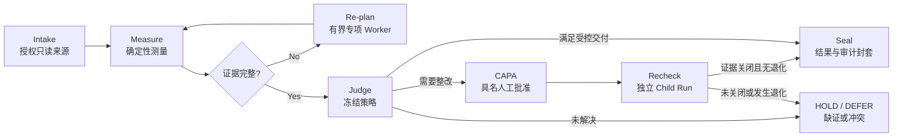

<p align="center">
  
</p>

<h1 align="center">VisionData Gate</h1>

<p align="center"><strong>让工业视觉图像走向可追责的结果</strong></p>
<p align="center"><em>A governed evidence agent for industrial vision data readiness.</em></p>

<p align="center">
  <a href="https://github.com/dukeandBaron/visiondata-gate-public/actions/workflows/ci.yml"></a>
  <a href="LICENSE"></a>
  
  
  
  
  
</p>

<p align="center">
  <a href="https://dukeandbaron.github.io/visiondata-gate-public/"><strong>Live Demo</strong></a>
  ·
  <a href="docs/quickstart.md"><strong>Quickstart</strong></a>
  ·
  <a href="docs/architecture.md"><strong>Architecture</strong></a>
  ·
  <a href="docs/api_reference.md"><strong>API</strong></a>
</p>

<p align="center">
  
</p>

<p align="center"><sub>公开站点固定为 <code>PUBLIC_SYNTHETIC_REPLAY</code>；本地或内网部署将同一工作台连接到受控 API。</sub></p>

## The Friction / 制造现场的断点

| **隐性数据投毒** | **僵化固定流水线** | **黑盒 AI 责任真空** |
|---|---|---|
| 跨划分泄漏、15 px 标注偏移或欠曝光，可能让离线指标仍显示 99.8%，上线后却出现系统性漏检。 | 固定脚本不理解证据冲突；工具故障时要么整链崩溃，要么无差别重试并浪费算力。 | 普通大模型可以生成建议，却无法把测量值、策略版本、批准人和派生数据版本绑定成责任链。 |

VisionData Gate 位于数据准备与模型发布之间。它把图像、标注、metadata、批次、策略与整改事实组织成版本化 Case；证据不足时，系统不会为了完成流程而制造 `PASS`。

它是**工业视觉数据准入与发布治理系统**，不是缺陷检测模型、PLC 控制器，也不替代质量负责人。

## Core Features / 核心能力

| 能力 | 已实现的产品行为 |
|---|---|
| **Bring Your Own Planner** | Planner 与 Provider Profile 通过窄合同解耦。`off`、`shadow`、`gated`、`replay` 四种模式让外部模型保持可选；请求前预计超出上下文预算时走确定性的 **0-call** 路径。 |
| **Deterministic Artifacts** | 可选的五类测量覆盖清晰度/曝光（Laplacian 与强度统计）、重复与跨集泄漏（dHash/MAE）、BBox/Mask 完整性、工况覆盖矩阵和 metadata 漂移；输出保留测点与证据引用。 |
| **Dynamic Re-planning** | Runtime 记录 selected/rejected Workers、选择原因、triggering evidence、预算和 Tool Receipt。冻结冲突案件中，首轮证据缺口触发 3 个专项 Worker，而不是全量扫描候选池。 |
| **Sandboxed Remediation** | Parent 来源保持只读。具名人员批准 CAPA 后创建私有派生版本，Child Run 按同一合同独立复验；`regressed_count > 0` 或证据仍未关闭时继续阻断。 |
| **Governed Audit Envelope** | RFC 8785 JCS 规范化与域分离 SHA-256 将 Case、Decision Packet、ToolTrace、GateResult 和 Outcome 工件绑定为篡改感知的 Audit Root。摘要是内容身份，不是数字签名或可信时间戳。 |
| **Human Gatekeeper** | `machine_write_permitted=false` 与 `production_decision_authority=human_only` 是强类型不变量。Agent 可以调查和建议，CAPA 与生产决定仍属于具名质量负责人。 |

## How It Works / 工作流



每次状态转换都由持久化事实支撑。工件缺失、ETag 过期、工具失败、预算耗尽或冲突未解时，前后端共同显示可恢复的阻断状态。

## Benchmarks & Scientific Rigor / 基准验证

### DynamicBench-v3

冻结的 8 夹具协议在相同终态合同下覆盖证据冲突、工具故障、不确定性和正常路径。

| 指标 | Dynamic planner | Fixed pipeline |
|---|---:|---:|
| 正确终态 | **8 / 8** | 4 / 8 |
| Unsafe release | **0 / 8** | **0 / 8** |
| 可恢复工具故障完成恢复 | **2 / 2** | 0 / 2 |
| 总工具调用 | **14** | 24 |
| 不必要调用 | **0** | 14 |

Dynamic 路径将总调用从 24 降至 14，减少 **41.7%**，同时保持与固定流水线相同的 fail-closed 安全底线。固定流水线的 4 个错误终态是证据不足时的保守 HOLD，不是误放行。

这些数字只证明冻结合成协议下的编排与恢复差异，不能写成工厂误放行率或模型准确率。协议、完整报告与证据边界见 [Benchmarks](benchmarks/README.md)。

在可公开复算的 VisA 工业代理协议中，Dynamic 与 Fixed 的正确终态均为 525/600、unsafe release 均为 0；Dynamic 调用 2,550 次，Fixed 调用 2,700 次。该结果只支持“不可恢复故障下减少 150 次冗余重试”，不支持 Dynamic 更准确或工厂 KPI 已测量。

### 历史授权私域离线 Pilot

一个 180 样本的 Omni 子集曾在本地只读来源上完成 Gate → CAPA → Derived Version → Child Run；当前公开 checkout 不含原始字节，不能据此现场重算：

| 观察项 | 结果 |
|---|---:|
| Findings，Parent → Child | `49 → 33` |
| 责任项 | `6 closed / 43 open` |
| 最终处置 | `TRANSFERRED_TO_INVESTIGATION` |
| 生产放行 | `false` |

系统没有把 finding 减少包装成整改成功，而是将未关闭责任继续转入人工调查。该结果证明产品路径处理过真实本地字节，不代表客户验收或工厂 ROI。误放行率、误拦截率与独立裁决后的整改通过率保持 `NOT_MEASURED_PENDING_ADJUDICATION`，直到取得 QMS 或双人复核真值。

## Quick Start / 快速开始

### 启动本地工作台

要求：Windows、Python 3.12、[uv](https://docs.astral.sh/uv/) 与 Node.js 22+。

```powershell
git clone https://github.com/dukeandBaron/visiondata-gate-public.git
cd visiondata-gate-public

.\setup_env.ps1
.\run_workbench.ps1 -Install
```

启动器会建立本机会话，在 loopback 地址启动 FastAPI 与 React 工作台，并打开浏览器。产品数据保留在配置的本地目录。

- Workbench：`http://127.0.0.1:4173`
- API health：`http://127.0.0.1:8787/v1/health`
- API schema：`http://127.0.0.1:8787/docs`

### 运行引导演示

```powershell
.\run_demo.ps1 -Install
```

该入口会创建隔离的合成项目、校验 Manifest，并打开精确的 Review 深链；它不会改变生产权限，也不会把仍受阻的 Child Run 改写为 `PASS`。

手动启动 API、配置 Session 与接入 BYOP Provider 见 [Quickstart](docs/quickstart.md) 和 [API Reference](docs/api_reference.md)。

## Ecosystem & Extensibility / 生态扩展

VisionData Gate 通过合同扩展，而不是把单一工厂假设写死在内核中。

| 扩展面 | 用途 |
|---|---|
| `skills/` | 声明输入、输出、权限和 evidence span 的有界工业工具 |
| `rulepacks/` | 可版本化阈值、策略扩展和 fail-closed 发布规则 |
| `adapters/` | 数据集、标注、检测结果与工业 metadata 的只读桥接 |
| `schemas/` | 可移植的 Evidence、Receipt、Decision 与 Lineage 合同 |
| Provider Profiles | Workspace 级 BYOP 配置；密钥保留在服务端 |
| `agentteams/` | Local/Hosted Transport 合同，不继承生产权限 |

CVAT 与 FiftyOne 路径已完成本地合同覆盖。MES、OPC UA、PLC、VisionMaster 和 Hosted Transport 在取得真实身份、端点及探测回执前保持 **not connected**；接口存在不等于现场部署完成。

扩展面的合同与安全边界见 [Architecture](docs/architecture.md)；可运行示例分别位于 `skills/`、`rulepacks/` 与 `adapters/`。

## Security & Boundary / 安全红线

1. **原始像素默认留在本地。** 当前核心合同固定 `raw_images_transmitted=false`；公开仓、Issue、日志和证据包排除私域图像、文件名、绝对路径、凭据与操作者回执。
2. **禁止机台反写。** Tool 与 Agent 合同固定 `machine_write_permitted=false`；当前实现不能写入 PLC、MES、相机或生产设备。
3. **最终决定属于人。** CAPA 批准、根因认定与生产放行必须由具名质量负责人完成；缺证时始终 fail closed。

Provider Key 由本地服务保存且不会通过 API 回显。连接非公开数据或外部模型前，请阅读 [Security](SECURITY.md) 与 [Compliance](docs/compliance.md)。审计协议见 [Governed Audit Envelope](docs/audit_envelope.md)。

---

<p align="center">
  <a href="CONTRIBUTING.md">Contributing</a>
  ·
  <a href="SECURITY.md">Security</a>
  ·
  <a href="CHANGELOG.md">Changelog</a>
  ·
  <a href="CITATION.cff">Citation</a>
  ·
  <a href="LICENSE">Apache-2.0</a>
</p>
