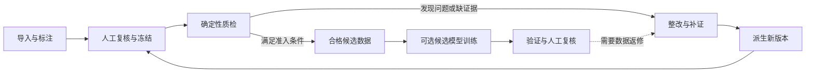

<p align="center">
  
</p>

<h1 align="center">VisionData Gate</h1>

<p align="center">
  <strong>让每次视觉数据返修，都有可复验的下一版。</strong><br />
  本地优先的工业视觉数据交付与迭代工作台
</p>

<p align="center">
  <a href="#quickstart">本地运行</a> ·
  <a href="https://github.com/dukeandBaron/visiondata-gate/releases">Windows 候选包</a> ·
  <a href="#workflow">工作流程</a> ·
  <a href="#architecture">技术主线</a> ·
  <a href="#agent">Agent 的作用</a> ·
  <a href="#versions">版本演进</a> ·
  <a href="#docs">文档</a>
</p>

VisionData Gate 面向**机器视觉算法工程师、方案商交付团队和数据质量负责人**，把图像与标注、质量检查、整改工单、版本复验和模型反馈放进同一个工作台。原始输入保留，整改形成新版本，关键决定由人确认。

<p align="center">
  
  <br />
  <sub>本地隔离验收截图，使用仓库内合成齿轮样本。框是人工示例标注，曲线来自像素量测，不是模型自动诊断或工厂效果证明。</sub>
</p>

## 为什么需要它

一次标注返修，难点不只是改好一个框。工程师还要回答：**改的是哪一版？哪些样本仍有问题？新版本是否重新检查过？下一轮训练用了什么数据？**

VisionData Gate 连接这段工作：从图像现场定位问题，把整改交给责任人，再用新版本和复验记录完成交接。它可以嵌入已有视觉项目，不要求把整条产线或训练系统推倒重来。

## 在工作台里可以做什么

| 工作 | 操作 | 留下什么 |
| --- | --- | --- |
| 图像与标注 | 导入图像／数据集、框选、保存标注、查看像素与剖面 | 图像身份、标注修订、量测依据 |
| 数据质检 | 检查曝光、清晰度、重复、标注风险及覆盖情况 | 有证据引用的问题与门禁结果 |
| Agent 任务 | 查看计划、工具调用；在支持的案件路径中调查证据缺口 | 执行记录、Worker 选择原因、待确认项 |
| 整改与数据池 | 人工复核、处理工单、派生新版本、独立复验 | 父子版本、整改结果、合格候选或待处理数据 |
| 模型与反馈 | 配置模型/API，登记本地权重；按条件执行候选训练与反馈复核 | 模型身份、评估记录、下一轮输入关联 |
| 团队协作 | 管理账户、注册审批、工作区和项目权限 | 可归属的操作与人工决定 |

**候选数据不等于标签真值，检查通过不等于允许生产上线。**缺证据、工具失败或版本变化时，系统保留待处理状态，不默认放行。

<a id="architecture"></a>

## 当前技术主线

项目按三个业务阶段解释，不把数据治理、模型训练和生产裁决混成一个“识别模型”：

1. **人机协同数据集冷启动**：人工完成标注与复核；可选模型未来只能提供预标注候选。输出是初始候选数据集版本，不代表标签真值已被独立确认。
2. **Agent 编排的数据质量治理**：确定性工具诊断，Agent 组织证据和整改计划，具名人员批准后只在派生副本执行，再由 Child Run 独立复验。必要条件不满足时保持 `HOLD`。
3. **受控模型开发与反馈回流**：冻结 train／val／test 后执行有界训练与独立评估；预测分歧经人工裁定，再通过新采集或新标注版本进入下一轮，val／test 不自动回灌 train。

治理控制环使用五个受控功能：Data Quality Diagnoser、Remediation Planner、Authorized Remediation Executor、Independent Verification Gate 和 Evidence-gap-driven Bounded Replanner。复验发现诊断缺证或定位错误时走 `DIAGNOSIS_REVISION`；整改无效、持续项未清或引入回归时走 `REMEDIATION_REVISION`。它们是现有六阶段 Runtime 的职责解释，不是为了包装而新增四个自治 Agent。

当前 VLM 预标注、样本级 Top-K query engine、Active Learning、TTT 和自动 Mask 生成均未作为完成能力声明。完整口径见 [技术术语表](docs/TECHNICAL_TERMINOLOGY.md) 与 [评审指导闭环](docs/REVIEW_GUIDANCE_CLOSURE_20260915.md)。

<a id="quickstart"></a>

## 快速开始

### 从源码运行本地 Web

准备 **Git、Python 3.12／3.13、[uv](https://docs.astral.sh/uv/) 和 Node.js 22.12+**。在一个新的工作目录执行：

```text
git clone https://github.com/dukeandBaron/visiondata-gate.git
cd visiondata-gate
uv sync --extra api --extra qa --locked
npm --prefix web ci
uv run python tools/run_cross_platform_workbench.py --check
uv run python tools/run_cross_platform_workbench.py
```

启动器会打开本地浏览器工作台。**首次使用先创建管理员；已有账户则登录。**随后创建工作区与项目，从 [sample_data](sample_data/README.md) 的合成样本开始，体验导入、标注、保存和检查。

这条确定性入门路径不要求 GPU 或模型 API Key。使用大模型规划或视觉训练时，再到“模型与 API”配置相应能力。源码启动需要保留启动终端；它不是直接面向公网的部署方案。若仓库当前为私有，克隆和下载需要访问权限。

端口占用、数据目录、重新打开及命令行用法见 [源码启动指南](docs/CROSS_PLATFORM_QUICKSTART.md) 与 [本地会话管理](docs/LOCAL_WORKBENCH.md)。

### 使用 Windows 桌面候选包

前往 [Releases](https://github.com/dukeandBaron/visiondata-gate/releases)，选择带验证回执和 SHA-256 清单的 **Windows x64 候选包**，先阅读对应版本说明再安装。

核心工作台内嵌运行组件；**可选的外部 Python、Torch、Ultralytics 与模型权重不随包分发**。候选安装器未签名，WebView2 是运行前提，独立干净机和同版本升级需另行验收。具体步骤见 [Windows 安装说明](docs/WINDOWS_INSTALLER.md)。

<a id="workflow"></a>

## 一条数据返修如何形成闭环

两种起点，共用同一套数据与审核流程：

- **还没有任务模型**：先整理并复核图像和标注，冻结满足训练准入条件的数据，再建立候选模型。
- **已经有模型**：登记可信权重与运行环境，结合新增数据或已复核反馈，准备下一轮候选。



循环的关键不是“再跑一次”，而是**保留旧版本，用新版本重新验收**：

- 原始来源不被整改覆盖；Child Run 独立检查派生数据。
- 完全重复样本只在审批范围内处理；近重复、划分冲突或标注争议需要进一步复核。
- “没有发现问题”不能代替正常样本的人工语义确认。
- 反馈先经人工分类，再关联下一轮数据；验证集、测试集不自动回灌训练。

流程与接口边界见 [平台架构](docs/AGENT_PLATFORM.md)、[数据复核与算力交接](docs/DATASET_REVIEW_AND_COMPUTE.md) 和 [学习反馈工作台](docs/QUALITY_LEARNING_WORKBENCH.md)。

<a id="agent"></a>

## Agent 在哪里，人又负责什么

**Agent 负责组织任务和证据，专业工具负责测量，人负责关键判断。**

单图取证用于查看当前图像、标注及问题依据；项目快照任务按冻结合同执行确定性检查。需要调查竞争假设、缺失证据和下一步补证时，使用 **Incident 案件编排路径**：可以查看 Worker 的选择／排除原因、预算、工具回执以及人工确认后的续跑记录。

这三条路径有不同职责。**不是每次上传都调用大模型，也不是每个任务都动态重规划。**是否实际调用、调用了什么、还有哪些证据缺失，以该次任务保存的记录为准。

系统不把模型建议当成已验证的根因，不替人批准整改或生产放行。配置提供方也不等于已经调用它。详情见 [Agent 平台](docs/AGENT_PLATFORM.md)、[模型规划配置](docs/INCIDENT_MODEL_PLANNER.md) 与 [用量和中断恢复](docs/AGENT_PLATFORM_OPERATIONS.md)。

## 接入已有工程流程

- **本地数据与模型**：图像和业务记录留在选定的数据目录；模型服务由使用者显式配置，不因打开页面自动调用外部模型。
- **工具与标注生态**：通过 REST API、Schema、Rule Pack 和 Adapter 扩展。CVAT／FiftyOne 的本地往返合同不等于目标服务已连接。
- **算力交接**：保留 CANN／昇腾等后续调度入口；当前离线交接状态为 `PREPARED_NOT_SUBMITTED`，不是集群作业提交成功。

不承诺任意格式开箱即用，也不将 MES、PLC、OPC UA 等未验证的连接写成已接入。接入前请查看 [公共 API](docs/PUBLIC_API.md) 和 [外部模型配置](docs/EXTERNAL_MODEL_CONFIGURATION.md)。

<a id="verification"></a>

## 验证与使用边界

项目持续验证本地流程、权限、失败恢复和数据身份；**工程测试通过不等于工业模型达标或客户收益成立**。

- **编排**：DynamicBench-v3 提供固定合成场景的对照与复现，不代表胜过未经实测的外部 Agent 框架。
- **模型**：可运行训练或推理流程，不等于精度足够；当前工业模型效果仍保留 HOLD。
- **安装**：每个 Windows 候选绑定自己的源码与回执，旧包的通过记录不自动适用于新构建。
- **数据与权限**：生产决定由人确认，`production_release_allowed=false`；工厂误放行／误拦截仍为 `NOT_MEASURED_PENDING_ADJUDICATION`。

完整 Git 历史的隐私处理仍是独立待办；**经审查的无历史快照，不等于整个 Git 历史可以公开**。静态合成回放也不等于本地可写工作台或工厂在线连接。

日期化结果、实验分母、安装回执与剩余限制集中在 [验证与交付状态](docs/README_STATUS_AND_EVIDENCE.md)。声明规则见 [Claim Scope](docs/CLAIM_SCOPE.md)，安全问题请按 [SECURITY.md](SECURITY.md) 报告。

<a id="versions"></a>

## 版本演进

| 阶段 | 主要变化 | 仍需注意 |
| --- | --- | --- |
| RC1／RC2 | 建立冻结实验、确定性质量门禁、Omni-180 脱敏基线和动态 Worker 触发证据 | 历史里程碑，不代表当前安装包或生产效果 |
| RC3 | 形成 Incident v6、Parent／Human／Derived／Child 闭环，并以 `49 → 33`、`6 closed / 43 open` 保存真实负向结果 | 终态仍为调查／HOLD，不是生产恢复 |
| RC4 | 收口复赛 60 秒演示、隐私安全静态回放和防守材料 | GitHub prerelease 不等于官网提交或评委验收 |
| Windows candidates | 将 React／Tauri／Spring／FastAPI 打入本地候选包，并修复桌面登录注册链 | 最新已发布候选早于当前源码；未签名，独立干净机仍未验证 |
| `CURRENT_SOURCE_UNRELEASED` | 产品化首页、工作簿截图、学习反馈、工程质量与评审术语继续进入源码 | 尚未据此生成新安装包或工业效果回执 |

详细的 tag、commit、构建与证据边界见 [版本演进与身份规则](docs/VERSION_EVOLUTION.md)。旧版本回执不会自动证明当前源码或新安装包。

<a id="docs"></a>

## 文档与参与

| 想做什么 | 从这里开始 |
| --- | --- |
| 本地运行或安装桌面候选 | [源码启动](docs/CROSS_PLATFORM_QUICKSTART.md) · [Windows 安装](docs/WINDOWS_INSTALLER.md) |
| 理解任务、复验和版本关系 | [平台架构](docs/AGENT_PLATFORM.md) · [数据复核](docs/DATASET_REVIEW_AND_COMPUTE.md) |
| 配置模型、API 与恢复 | [外部模型](docs/EXTERNAL_MODEL_CONFIGURATION.md) · [平台操作](docs/AGENT_PLATFORM_OPERATIONS.md) |
| 核对实验和工程质量 | [基准复现](docs/BENCHMARK_REPRODUCIBILITY.md) · [工程质量](docs/ENGINEERING_QUALITY_IMPLEMENTATION.md) |
| 区分 RC、源码和安装包版本 | [版本演进](docs/VERSION_EVOLUTION.md) · [Changelog](CHANGELOG.md) |
| 扩展功能或参与贡献 | [公共 API](docs/PUBLIC_API.md) · [贡献指南](CONTRIBUTING.md) · [Issues](https://github.com/dukeandBaron/visiondata-gate/issues) |

欢迎围绕数据导入、标注往返、失败恢复和可复现实验提出问题或贡献。提交 Issue／PR 时请使用最小合成示例，**不要附带客户图像、密钥、个人信息或私有运行回执**。

## License

项目代码采用 [Apache-2.0](LICENSE)，声明见 [NOTICE](NOTICE)。可选模型、权重、训练运行环境和第三方组件遵循各自许可证；独立进程不豁免 Ultralytics 的 AGPL／Enterprise 许可义务。

[版本记录](CHANGELOG.md) · [软件引用](CITATION.cff) · [SBOM](docs/SBOM.cdx.json) · [第三方声明](docs/THIRD_PARTY_NOTICES.md) · [发布准备](docs/RELEASE_PREPARATION.md)
