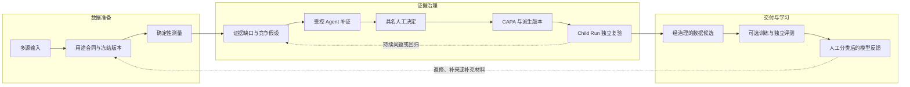

<p align="center">
  
</p>

<h1 align="center">VisionData Gate</h1>

<p align="center">
  <strong>工业视觉数据治理与发布 Agent</strong><br />
  把存在质量风险的数据，推进为责任闭合、证据充分、可独立复验的数据候选版本
</p>

<p align="center">
  <a href="LICENSE"></a>
  
  
  
</p>

<p align="center">
  <a href="https://dukeandbaron.github.io/visiondata-gate/"><strong>在线 Demo</strong></a> ·
  <a href="https://dukeandbaron.github.io/visiondata-gate/#/review"><strong>60 秒评审核验</strong></a> ·
  <a href="https://dukeandbaron.github.io/visiondata-gate/#/workspace"><strong>图像工作簿</strong></a> ·
  <a href="https://github.com/dukeandBaron/visiondata-gate/releases"><strong>Windows 下载</strong></a> ·
  <a href="#quickstart"><strong>本地运行</strong></a>
</p>

VisionData Gate 位于工业图像采集、标注与模型训练交付之间，管理每一版数据进入下一步前的证据条件。缺陷识别由下游模型完成；本系统负责数据版本、问题处置、人员责任和复验结果能否对账。

<table>
  <tr>
    <td width="33%"><strong>输入</strong><br />图像、标注、元数据、任务用途和现场规则</td>
    <td width="33%"><strong>治理</strong><br />确定性测量、Agent 补证、人工批准和 Child Run</td>
    <td width="33%"><strong>输出</strong><br />经治理的数据候选、证据报告、责任队列和评测回执</td>
  </tr>
</table>

<p align="center">
  
  <br />
  <sub>公开合成案件的只读命令中心。它展示 Agent 的选择与 Trace，不冒充客户运行或生产系统。</sub>
</p>

> [!IMPORTANT]
> 在线 Demo 与公开 Agent 案件用于理解、评审和复现。客户验收、工厂 KPI、设备写入和生产授权均保持 `HOLD`，系统固定执行 `production_release_allowed=false`。

<details>
<summary><strong>导航：产业问题、创新机制与核验证据</strong></summary>

- [工业现场为什么需要数据交付门禁](#industry-problem)
- [项目如何形成产业闭环](#business-loop)
- [为什么这里需要 Agent](#why-agent)
- [三项核心创新](#innovation)
- [一轮治理任务如何完成](#workflow)
- [架构、安全与责任边界](#architecture)
- [Demo 与验证结果](#verification)
- [快速开始](#quickstart)
- [开放复用](#reuse)
- [决赛评分证据索引](#finals-evidence)

</details>

<a id="industry-problem"></a>

## 工业现场为什么需要数据交付门禁

工业视觉团队在换型、补采、标注返修和模型迭代中，反复面对的并非单一模型问题，而是一组相互关联的数据风险：采集条件变化、跨划分重复、标注错误、覆盖缺口和元数据冲突。

图片能打开、模型能训练，不代表这批数据已经具备交付条件。一次没有版本和责任约束的返修，可能让旧标注继续被使用；一次未经独立复验的整改，也可能把“动作已执行”误写成“问题已关闭”。

| 使用角色 | 现实任务 | 当前断点 | 需要的结果 |
| --- | --- | --- | --- |
| **算法工程师** | 换型补采、数据清洗、训练集维护 | 工具分散，问题和版本难以对齐 | 可复算的测点与经治理的数据候选 |
| **视觉方案商** | 多项目交付、客户返修、验收准备 | 工单、标注和复验缺少统一案件 | 可追踪的处置、版本和交付证据 |
| **质量负责人** | 责任确认、风险判断、放行把关 | 建议与事实混合，关闭依据不足 | 具名决定、逐项对账和明确 HOLD |

项目处理四类高频交付断点：

- **人机协同断点**：图像、标注、测量、问题与决定分散在不同工具中。
- **全流程上下文断点**：问题、工单、修订和重新验证缺少统一身份与版本关系。
- **工业安全断点**：工具失败、证据不足或责任未清时，流程结束不能等同于允许放行。
- **证据与复验断点**：模型分数和 Agent 建议缺少来源、选择原因、血缘与 Child Run 证明。

[行业场景、真实边界与 Shadow Test 协议](docs/INDUSTRY_SCENARIO_VALUE.md)

<a id="business-loop"></a>

## 项目如何形成产业闭环

VisionData Gate 把数据质量工作组织为一条可重复的业务链。系统首先冻结任务用途与数据版本，再完成确定性检查；上传快照 Gate 使用固定确定性工具；需要调查冲突、工具故障或未知异常时，另行创建 Incident 案件，由受控 Agent 组织补证。

高影响动作必须由具名人员批准。CAPA 只作用于派生版本，Child Run 按同一合同重新检查，并把责任项标记为关闭、持续开放或新增回归。



这条链路最终交付四类对象：评审证据和问题定位、经治理的数据候选版本、候选模型与评测回执、责任队列与下一步行动。训练和模型反馈属于可选闭环，不会自动获得生产权限。

<a id="why-agent"></a>

## 为什么这里需要 Agent

已知、稳定、无冲突的 SOP 应由固定程序完成。ArchBench-v2 的 288 条同协议记录也得到这一负结论：传统流程、单 Agent 与多 Agent 的质量持平，增加角色本身没有价值。

Agent 只进入固定脚本难以预写的异常部分：中间证据发生冲突、工具失败、出现新证据、预算不足，或需要判断下一项检查是否仍有区分价值。

| 参与者 | 负责什么 | 留下什么 | 不具备的权限 |
| --- | --- | --- | --- |
| **确定性工具** | 清晰度、曝光、重复、泄漏、标注结构和覆盖检查 | 测点、阈值、Finding、ToolReceipt | 不解释业务责任，不作最终放行 |
| **受控 Agent** | 判断证据缺口，选择 Worker，维护假设、预算和停止条件 | 选择／拒绝理由、计划、Trace、Decision Packet | 不把建议冒充测量，不批准高影响动作 |
| **具名人员** | 确认任务语义，批准或拒绝 CAPA，作出最终裁定 | 人工回执、责任归属和批准范围 | 不能覆盖证据完整性与版本约束 |
| **平台系统** | 保存状态，绑定版本，回读 CAPA、Child 与 Outcome | 血缘、审计封套和可复验摘要 | 不因流程完成自动授予生产权限 |

DynamicBench-v3 在相同输入、工具与 Fail-Closed Judge 下记录：动态重规划得到 **8/8** 正确终态，固定规则基线为 **4/8**；工具调用由 **24 次降至 14 次**，两者不安全误放行均为 **0/8**。结果证明冻结协议内的编排完整性与效率，不代表多 Agent 普遍更强。

[DynamicBench-v3 协议与完整结果](docs/DYNAMICBENCH_V3.md) · [Agent 架构](docs/AGENT_PLATFORM.md)

<a id="innovation"></a>

## 三项核心创新

### 1. 证据缺口驱动的选择性 Agent 编排

系统不会在问题出现后无条件调用更多 Agent。它先判断缺少什么证据、哪些假设仍无法区分，再按资格、严重度、假设区分信息、证据质量、成本桶、稳定 Worker ID 和冻结预算选择专项 Worker。成本桶不是已经实测的最优信息增益；未知成本保留为未知。

每次选择同时保存 `selected / rejected / reason / budget / triggering evidence`。选择策略用于判断下一项检查是否有补证价值，并受预算与策略约束；实际结果仍以调用回执为准，不预先保证补查会改变结论。

**可演示证据：**命令中心中的 Worker 选择与拒绝、竞争假设、预算、六阶段 Trace，以及 DynamicBench-v3 的固定基线对照。

### 2. 具有否决权的 Parent–CAPA–Child 整改闭环

Parent 数据版本保持只读，Agent 只能提出方案。具名人员批准具体动作后，系统生成私有 Derived Version；Child Run 按同一合同独立复验，不回写父版本结论。

Finding 数量减少不能直接关闭责任。系统必须逐项核对已关闭、持续开放和新增回归项；未解决的关键责任会继续 HOLD，或转入重新采集与人工调查。

<p align="center">
  
  <br />
  <sub>本地隔离合成环境中的真实任务评审界面。责任条、CAPA 与 Child/Outcome 均由持久化事实生成。</sub>
</p>

全量来源画像记录 **4,464 张图像、1,439 个 Mask**，治理闭环则采用固定子集：派生版本包含 **180 张图像、60 个 Mask**。两者分母不同，全量画像不等于全量训练或全量整改验收。Child Finding 从 **49 降至 33**，逐项责任核验只确认 **6 条关闭、43 条继续开放**，最终状态仍为 `HOLD`。这个负结果证明系统不会把“Finding 变少”包装成“生产恢复”。

上传快照目前可自动执行的修复是：人工批准后，在派生版本排除同划分、同身份的精确重复，且保留覆盖下限。跨划分、近重复、标注冲突不能盲目删除；重拍、返标和补采需要人工提交新证据。像素工单与 CAPA 责任账本也不会自动合并关闭数量。[逐模块能力表](docs/CAPABILITY_STATUS.md)

[任务完成 UI 验证回执](docs/FINALS_TASK_COMPLETION_UI_20260916.md) · [证据与实验边界](docs/EVIDENCE_AND_BENCHMARKS.md)

### 3. 先治理、后检索的证据记忆与跨工件审计

历史证据只有通过来源、任务关联、版本一致性、质量完整性、授权范围和用途校验后，才具备进入受控证据集合的资格。检索按任务、问题类型、工艺范围和版本边界筛选，不把历史经验冒充当前测量。

引用记录包含谁在什么任务中使用了哪些证据、用途、时间、版本和影响范围。发现错误来源后，系统可以定位受影响的任务、收缩使用范围并保留撤销记录。

**可核验入口：**Evidence Span、Lineage、Audit Envelope、JCS 规范化和域分离 SHA-256。它们用于发现漂移和跨工件不一致，不冒充数字签名或可信时间戳。

[治理审计封套](docs/GOVERNED_AUDIT_ENVELOPE.md) · [审计信任边界](docs/AUDIT_TRUST_BOUNDARY.md)

<a id="workflow"></a>

## 一轮治理任务如何完成

| 阶段 | 用户或系统动作 | 关键产物 | 失败时如何处理 |
| --- | --- | --- | --- |
| **1. 任务接入** | 选择图像、标注、元数据、用途和规则包 | Input Contract、版本身份 | 输入不完整时拒绝接入 |
| **2. 确定性测量** | 运行图像质量、重复泄漏、标注完整性、覆盖与漂移检查 | Metrics、Finding、ToolReceipt | 工具失败进入证据状态，不伪造结果 |
| **3. Agent 补证** | 分析证据缺口，选择 Worker，维护竞争假设和预算 | Plan、Selection Receipt、Trace | 预算或证据不足时请求人工补证 |
| **4. 人工决定** | 具名人员批准、拒绝或要求继续补证 | Human Decision、CAPA Approval | 无批准则保持 HOLD |
| **5. 派生整改** | 在 Derived Version 中执行获批动作 | 责任人与范围、版本血缘 | Parent 始终只读 |
| **6. Child 复验** | 同合同重新测量并逐项对账 | Closed / Open / Regressed | 持续项进入整改修订或调查 |
| **7. 受控交付** | 形成数据候选、评审包或可选训练任务 | Governed Dataset、Outcome Envelope | 不自动升级为生产放行 |

证据不足或诊断需要修订时进入 `DIAGNOSIS_REVISION`；整改无效、问题持续或引入回归时进入 `REMEDIATION_REVISION`。这是两种不同的回退路径，不是简单重跑。

<a id="architecture"></a>

## 架构、安全与责任边界

系统采用一个受控 Agent 内核、两条版本化闭环和一套共享证据底座。数据治理闭环负责数据准入与整改复验；模型开发闭环负责可选训练、独立评测和人工分类后的反馈回流。

从用户任务看，三阶段依次是：**人机协同数据集冷启动 → Agent 编排的数据质量治理 → 受控模型开发与反馈回流**。它们共享任务与版本身份，但保留各模型分支的独立验收条件。[术语与执行合同](docs/TECHNICAL_TERMINOLOGY.md)

| 技术层 | 项目内实现 | 评委可以核验什么 |
| --- | --- | --- |
| **交互与任务入口** | React 工作台、Tauri 桌面外壳、Spring WebFlux 本地网关、FastAPI 服务 | 同一工作空间、项目、任务与版本作用域 |
| **确定性观测** | 图像质量、重复泄漏、标注完整性、覆盖矩阵和元数据漂移 | 测点、阈值、Finding 和工具回执 |
| **受控 Agent Runtime** | Incident v6、Worker Selection、Frozen Judge、有界 Planner | 上下文、状态、预算、选择理由和完整调用链 |
| **人员治理与执行** | Named Human Authority、CAPA、Derived Version、Child Run | 具名批准、责任范围和逐项复验结果 |
| **证据与审计底座** | SQLite、Evidence Artifact、Lineage、JCS、SHA-256、Audit Envelope | 跨版本对账、漂移发现与审计记录 |

### 三条安全红线

| 红线 | 当前设计 |
| --- | --- |
| **原始图像不出域** | 本地工作台使用选定目录；在线工作簿只在当前标签页处理图像 |
| **机器不写生产系统** | 项目不具备 PLC、相机或生产设备写入权限，Adapter 必须独立授权 |
| **生产放行只由人执行** | Agent 只能组织证据与建议，最终决定绑定具名人员与任务身份 |

证据不足、工具错误、版本漂移、授权缺失、人工审批缺失或无法完成责任对账时，系统保持 Fail-Closed。流程完成、Gate 通过、CAPA 完成或 Child 通过，都不会自动改变生产设备状态。

[完整技术路线](docs/PROJECT_TECHNICAL_OVERVIEW.md) · [自研与第三方边界](docs/DEVELOPMENT_PROVENANCE.md) · [安全策略](SECURITY.md)

<a id="verification"></a>

## Demo 与验证结果

### 三种核验入口

| 入口 | 评审者可以实际操作什么 | 证据边界 |
| --- | --- | --- |
| **在线图像工作簿** | 更换自己的图片，复算 SHA、亮度、清晰度和同会话字节重复；人工框选并导出 JSON | 浏览器当前标签页；不上传、不创建后端案件、不生成生产 PASS |
| **公开合成 Agent 案件** | 查看触发证据、Worker 选择／拒绝、竞争假设、预算、CAPA 血缘和六阶段 Trace | SHA 绑定的静态回放；不冒充当前上传图片的 Agent 结果 |
| **本地完整工作台** | 使用账户、项目和持久化 API，执行具名决定、派生整改、Child Run 与支持的模型任务 | 本机受控运行；客户验收和生产授权需另行取证 |

[按 60 秒评审核验路径打开 Demo](https://dukeandbaron.github.io/visiondata-gate/#/review) · [现场改变输入并复现](docs/LIVE_REPRODUCTION.md)

### 冻结结果与适用边界

> [!NOTE]
> 每项实验保留自己的输入、基线、分母与适用范围。项目不把不同实验拼成一个“综合准确率”。

| 证据 | 已记录结果 | 能证明什么 | 不能证明什么 |
| --- | --- | --- | --- |
| **ArchBench-v2** | 传统流程、单 Agent、多 Agent；288 条同协议记录；质量持平 | 固定 SOP 下不支持“多 Agent 必然更好” | 不评价异常条件下的动态重规划 |
| **DynamicBench-v2** | 24 个夹具 × 4 种顺序 × 3 次重复，共 288 条；顺序不变与重复稳定均 `24/24` | 冻结 Worker 选择规则的确定性 | 不是主动学习或已测最优调度 |
| **DynamicBench-v3** | 正确终态 `8/8 vs 4/8`；工具调用 `14 vs 24`；双方误放行 `0/8` | 冻结合成协议内的重规划完整性与效率 | 外部模型调用为 0；不是工厂准确率 |
| **DynamicBench-v4** | 4/4 实际 ProductService 案件通过，包含工具失败关闭 | Agent 合同进入本地产品服务链路 | 不是客户环境或外部模型评测 |
| **Prompt Injection v2** | 固定攻击 `12/12` 拦截；固定良性输入 `6/6` 放行 | 对已知固定文本攻击集的策略行为 | 未知、自适应或多模态攻击的普适防护 |
| **授权离线试跑** | 180 图像、60 Mask；Finding `49 → 33`；`6 closed / 43 open`；最终 HOLD | 整改、派生版本和 Child Run 能保留真实负结果 | 不是客户 KPI、工厂在线 Shadow Test 或 ROI |
| **VisA Normality 开发代理** | capsules 子集、3 个固定种子；Image AUROC `0.657823`、正常 FPR `0.277778`、Pixel F1 `0.090093` | 指定开发代理上的异常信号与评测记录 | 不证明工业模型达标，不是客户现场准确率 |
| **公开候选源码回归** | 2094 collected；`2070 passed / 24 skipped / 0 failed / 0 errors` | `f7f31f7` 在锁定 Python 3.12 环境中的一次连续全仓回归 | 不是外部认证，不自动升级安装器或工厂效果 |

[Benchmark Suite](benchmarks/README.md) · [完整回归边界](docs/FULL_REGRESSION_F7F31F7_20260916.md) · [当前状态与事实源](docs/README_STATUS_AND_EVIDENCE.md)

<a id="quickstart"></a>

## 快速开始

### 在线体验

[打开在线 Demo](https://dukeandbaron.github.io/visiondata-gate/) 或 [直接进入图像工作簿](https://dukeandbaron.github.io/visiondata-gate/#/workspace)。在线站点是静态公开体验，不提供账户、持久化业务后端或生产授权。

### 本地完整工作台

准备 Python 3.12／3.13、[uv](https://docs.astral.sh/uv/)、Node.js 22.12+ 和 Git：

```bash
git clone https://github.com/dukeandBaron/visiondata-gate.git
cd visiondata-gate
uv sync --extra api --extra qa --locked
npm --prefix web ci
uv run python tools/run_cross_platform_workbench.py --check
uv run python tools/run_cross_platform_workbench.py
```

首次打开时创建管理员，再建立工作区和项目，并从 [公开合成样本](sample_data/README.md) 开始。确定性数据检查不要求 GPU 或外部模型 Key。[启动与排错](docs/CROSS_PLATFORM_QUICKSTART.md)

Windows 也可使用 `./run_demo.ps1 -Check` 检查环境，再运行 `./run_demo.ps1`；这是同一个真实 API/Web 启动器，不依赖旧私域快照。

### 模型中心：训练和推理分别授权

检测训练支持有界 CPU 监督训练；Normality 页支持证据包登记、独立沙箱批准、图像资产冻结与推理回执。运行环境与合法权重由用户明确提供，不静默下载或加载，模型信号不直接变成标签真值。

YOLO 训练预算为 **10–600 秒**；输入冻结拒绝**同一分区的字节重复或解码像素重复**，失败、取消与超时保留证据。[模型 API 合同](docs/VISION_MODEL_API_CONTRACT.md) · [任务保留与恢复](docs/MODEL_JOB_RETENTION.md)

参考 NumPy 学习闭环与 YOLO/Normality 分支分别验收。Normality 支持真实 PNG 热图、具名反馈保存与回读，以及**单次自监督适应（TTT）**：冻结主干和阈值，只更新当前会话的重建模块，独立参考组检查后采用或回滚，不覆盖父模型。

在已有 VisA 模型包上，真实 CPU 执行完成 3 步更新；16 张开发参考的 TP/TN/FP/FN 更新前后均为 `5/6/2/3`。这证明更新与复验链路已执行，**尚未证明检测质量提升**。参考组基线全漏检的另一轮在更新前被拒绝。永久在线学习、RL 与自动语义标注不因单次 TTT 而获得实现声明。[执行方法与复现](docs/NORMALITY_TTT.md) · [能力、接口与未完成连接](docs/CAPABILITY_STATUS.md)

### Windows 候选

最新公开 prerelease 为 [`windows-local-f7f31f7-finals-20260916`](https://github.com/dukeandBaron/visiondata-gate/releases/tag/windows-local-f7f31f7-finals-20260916)，绑定源码 `f7f31f7048b14b79990a445f285946f46d3bc41f`，状态为 `limited review / RELEASE_HOLD`。

<details>
<summary><strong>查看候选验证结果与未决项</strong></summary>

候选完成 113/113 提取态 HTTP 检查、两轮包内学习、实际安装启动、SQLite、七步 Tauri UI Automation 和卸载验收。

安装器旁附 `BUILD_MANIFEST.json`、`SOURCE_MANIFEST.json`、`DELIVERY_STATUS.json` 和 `SHA256SUMS.txt`。该已发布候选的安装器 SHA-256 为 `e32b10cf7e6ac8a9cdeca06b00973c29ff08acec2ae193fbf80c9d0d9a48e826`；后续源码更新不会自动进入这个二进制。

安装器尚未签名，独立干净机和同版本升级尚未验证，因此不是生产发行。[Windows 安装说明](docs/WINDOWS_INSTALLER.md) · [完整候选记录](docs/WINDOWS_CANDIDATE_F7F31F7_20260916.md)

</details>

<a id="reuse"></a>

## 开放复用

开源价值不只取决于公开文件数量，更取决于第三方能否理解合同、运行示例、替换组件并重新验证。核心代码、合成示例与 Benchmark 公开；客户数据、私域回执、密钥和未授权模型不公开。

| 可复用资产 | 入口 | 可替换内容 | 当前边界 |
| --- | --- | --- | --- |
| **Agent 与闭环内核** | [代码地图](src/visiondata_gate/README.md) | Worker、Planner、Judge 和 Adapter | 状态与回执合同必须保持一致 |
| **确定性治理工具** | [公共 API](docs/PUBLIC_API.md) | 图像、标注、覆盖和元数据检查 | 现场阈值需要重新验证 |
| **工业 Skill** | [SDK](docs/INDUSTRIAL_SKILL_SDK.md) · [合成示例](examples/reuse/README.md) | Skill 实例与精确版本 | 受信注册，不是任意代码沙箱 |
| **Schema 与 Rule Pack** | [Schema](schemas/README.md) · [Rule Pack](rulepacks/industrial-v1.json) | 数据格式、权限和现场规则 | 本地合同不代表工厂认证 |
| **外部系统接入** | [Adapter SDK](src/visiondata_gate/adapter_sdk.py) | 数据源、QMS/MES/CVAT 等适配层 | 离线 conformance 不代表已经连接 |

最小 SDK 示例不需要模型、网络或工业数据：

```bash
uv run --no-sync python examples/reuse/metadata_skill.py --metadata-count 12 --observed-count 14
```

[复用合同](docs/OPEN_REUSE_CONTRACTS.md) · [版本兼容](docs/VERSIONING.md) · [贡献指南](CONTRIBUTING.md)

[五份工作流 Skill](skills/README.md) 可按合同改编；文本 Skill 不等于已经安装的可执行插件。

<a id="finals-evidence"></a>

## 决赛评分证据索引

下表对应 GOAI 2026 赛道二决赛的 100 分结构。它提供可核验入口，不预测得分，也不把计划或模拟实验升级为已实现的客户价值。

五个维度依次为 **20 / 25 / 25 / 15 / 15 分**；二级考核点分值逐项列出。

| 一级维度 | 二级考核点 | 分值 | README / 仓库中的直接证据 | 当前缺口 |
| --- | --- | ---: | --- | --- |
| **问题价值与实际影响** | 场景真实性、重要性与高频性 | 8 | 目标角色、换型／返修流程、四类交付断点、[行业场景说明](docs/INDUSTRY_SCENARIO_VALUE.md) | 客户任务频次原始记录待补 |
|  | 用户／业务价值证据 | 7 | 运行日志、授权离线试跑、真实与合成边界 | 客户时间、成本、质量基线和 ROI `NOT_MEASURED` |
|  | 落地复制与推广潜力 | 5 | Schema、Rule Pack、Adapter、Skill、Site Pack 与复用合同 | 第二个独立机构 clean-run 待取得 |
| **创新性** | Agent 任务范式或交互机制 | 10 | 证据缺口触发、Worker 选择／拒绝、具名人员最终决策 | 不以角色数量或 API 调用证明创新 |
|  | Agent 闭环与解决方式 | 10 | Parent/Human/Derived/Child、两类修订、失败关闭和人工恢复 | 生产 Shadow 闭环保持 HOLD |
|  | 相对同类方案的实质差异 | 5 | 固定 SOP 负结论、DynamicBench-v3、[方案比较](docs/AGENT_PLATFORM_COMPARISON.md) | 未实跑外部框架不写成结果 |
| **技术／研究深度** | Agent 架构、规划与工具调用 | 10 | 六阶段 Runtime、预算、状态、ToolTrace、Decision Packet | 现场需展示同一 Run 完整调用链 |
|  | 自研贡献与复杂任务处理 | 8 | 合同、编排、CAPA、Child、Audit、自研与 AI 辅助开发披露 | 部分模型运行时属于可选第三方依赖 |
|  | 安全、合规与可追溯 | 7 | 权限、人类闸门、Fail-Closed、数据边界、血缘和审计封套 | 签名、可信时间戳和生产 IAM 未实现 |
| **完成度与可验证性** | 核心任务闭环与稳定性 | 8 | 现场重跑、DynamicBench-v4、全仓回归、Windows 候选 | 评委陌生输入仍需现场运行 |
|  | 产品体验与结果一致性 | 7 | 在线体验、本地工作台、源码／安装器／回执绑定 | 最终 PPT、Demo 与封版 SHA 需再次对账 |
| **开源价值与复用** | 核心组件、Workflow、Skill 开放 | 7 | Public 主仓、代码地图、Skill、Schema、SDK、Benchmark | 私域数据和外部模型不属于开放范围 |
|  | 文档、部署、复用与第三方验证 | 8 | README、Quickstart、License、示例、版本记录、Issue／PR 模板 | 独立第三方部署成功记录尚未取得 |

[查看完整 13 项证据／HOLD 对照](docs/FINALS_EVIDENCE_MAP.md)

## 当前声明边界

- 在线站点是静态体验，没有业务后端、账户持久化或真实生产写入。
- 公开 Agent 案件是 SHA 绑定的合成回放，不声称处理当前上传图片。
- Windows 候选未签名，独立干净机、客户验收和工厂效果仍为 HOLD。
- [异常阈值治理](docs/ANOMALY_OPERATING_POINT.md)处于 `SOURCE_COMPONENT_TESTED / PRODUCT_API_NOT_CONNECTED`，不生成可部署阈值。
- 授权离线试跑证明整改和复验结构，不替代客户采用记录，也不赋予原数据再分发权。
- 未绑定分母和原始记录的运营百分比不作为项目的已实现证据。

[完整 Claim Scope](docs/CLAIM_SCOPE.md) · [数据与公开边界](docs/PUBLICATION_BOUNDARY.md) · [当前交付状态](docs/README_STATUS_AND_EVIDENCE.md)

## 数据、许可证与贡献

原始数据和业务记录保存在用户选择的本地目录；外部模型由用户显式配置。图像上传、具名审批和模型加载具有独立权限，设备写入与自动生产放行不属于本项目权限。

项目原创代码使用 [Apache-2.0](LICENSE)。第三方库、模型、权重和数据不由本项目重新许可；可选 Ultralytics 的 AGPL／Enterprise 条款不能由进程隔离或本项目许可证替代。[许可与分发边界](docs/LICENSING.md) · [第三方声明](docs/THIRD_PARTY_NOTICES.md) · [SBOM](docs/SBOM.cdx.json)

欢迎贡献数据格式适配、工业 Skill、标注往返、失败恢复与可复现实验。请通过 [Issues](https://github.com/dukeandBaron/visiondata-gate/issues) 提交最小合成案例，或阅读 [贡献指南](CONTRIBUTING.md)。请勿在 Issue、PR 或公开附件中上传客户图像、个人信息、密钥或私有运行回执。

[复现实验](docs/BENCHMARK_REPRODUCIBILITY.md) · [工程质量](docs/ENGINEERING_QUALITY_IMPLEMENTATION.md) · [版本演进](docs/VERSION_EVOLUTION.md) · [CHANGELOG](CHANGELOG.md) · [软件引用](CITATION.cff)

[技术提交包构建与完整性核验](docs/TECHNICAL_SUBMISSION_BUNDLE.md)
