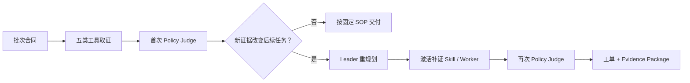

# VisionData Gate｜工业视觉数据治理与发布 Agent

[](https://github.com/dukeandBaron/visiondata-gate/actions/workflows/ci.yml)
[](https://dukeandbaron.github.io/visiondata-gate/)

GOAI 世界人工智能开源大赛赛道二“无界应用 Boundless Agents”作品，行业方向为 AI+工业制造。

VisionData Gate 面向工业视觉算法工程师和数据治理团队，把“数据批次能否进入实验训练池”组织成一条可运行的 Agent 业务闭环：理解审核目标、调用五类检查工具、依据中间证据动态补证、生成整改工单、在保留副本上修复、按同一合同复验，并交付可校验的 GateResult 与证据包。

项目主叙事是行业应用。Agent Infra 是后台可信能力，用于 typed task、工具白名单、证据触发调度、失败关闭、reason trace 和 adapter 复用；不把框架本身当作用户价值。

## 30 秒理解

| 评委问题 | 回答 |
|---|---|
| 谁在使用？ | 工业视觉算法工程师与数据治理团队 |
| 解决什么问题？ | 在图像、标注和元数据进入实验训练池前完成审核、补证、整改与复验 |
| 为什么需要 Agent？ | 首轮工具证据可能暴露新缺口或冲突，后续任务不能总由固定 DAG 预先写死 |
| 核心创新是什么？ | **证据驱动的动态 Agent 重规划**：先取证和初裁，再决定是否激活补证 Skill/Worker |
| 最终交付什么？ | GateResult、findings、整改工单、规则检查、reason trace、证据矩阵与 SHA-256 |
| 如何证明？ | 288 条同协议架构实验、Omni-180 固定公开 pilot、可重放证据与失败关闭反例 |

评委建议从[在线 Demo](https://dukeandbaron.github.io/visiondata-gate/)开始，再按 [`docs/00_OVERVIEW.md`](docs/00_OVERVIEW.md) 的五分钟路径抽查代码与证据。

## 业务闭环

```text
提交图像批次、标注、元数据和审核目标
  → Manager 校验合同、场景与权限
  → Leader 并行调度五类只读 Worker
  → 首次 Policy Judge 形成中间结论
  → 证据异常时动态增派 Worker 补证/对账/转调查
  → 再次裁决并生成整改工单
  → 在保留副本上执行允许的整改
  → 按原合同复验
  → 交付 GateResult、evidence matrix、reason trace 和 SHA-256
```

最终结果不是聊天文本，而是结构化结论、findings、work orders、rule checks、工具 trace、证据矩阵和可验证交付凭证。

## 与普通 Agent / 固定 Workflow 的区别

| 维度 | 普通 Chat Agent | 固定 Workflow | VisionData Gate |
|---|---|---|---|
| 目标 | 回答问题 | 执行预设步骤 | 形成可执行的数据发布结论 |
| 事实依据 | 语言上下文 | 节点输出 | 版本化工具证据与冻结规则 |
| 任务结构 | 对话轮次 | 固定 DAG | 首轮取证后按证据重规划 |
| 错误处理 | 重新生成 | 节点重试 | `DEFER` / `RECAPTURE` / rollback / 转调查 |
| 最终输出 | 文本 | 流程结果 | GateResult、工单、trace 与 Evidence Package |
| 可审计性 | 依赖回答引用 | 依赖运行日志 | 工具 → finding → 工单 → rule check → recheck 可追踪 |

## 已完成到哪一层

1. **已工程实现**：工作台、Reviewer Mode、REST API、五类工具、证据触发 Dynamic Leader、Frozen Policy Judge、整改工单、同合同复验和证据包均已接入本地可运行闭环。
2. **已公开数据实跑**：固定 180 张公开图像完成 Policy Gate，触发 1 次重规划、3 个动态 Worker、45 条 findings 与 45 张工单，8 项规则检查通过，结论为 `RECAPTURE`。
3. **下一阶段外部验收**：客户 shadow test、工厂只读接入、生产 IAM/部署、外部 LLM 与 hosted AgentTeams transport 需要相应外部主体或平台回执。

第三层是把已完成能力扩展到外部环境所需的新证据，不反向否定前两层。机器可读证明见 `evidence/submission/vdg-20260816-rc1/scenario_delivery_receipt.json`。

## 产品入口

- 企业工作台：项目、审核任务、审核记录、能力目录、API 接入和安全边界；
- 评审模式：应用故事、三级场景证明、动态重规划 Canvas、ArchBench-v2 负结论和 Claim Scope；
- 在线评委 Demo：[https://dukeandbaron.github.io/visiondata-gate/](https://dukeandbaron.github.io/visiondata-gate/)，交互展示固定公开运行与证据触发 Canvas；
- REST API：企业 Agent、SaaS 或数据流水线可提交任务并下载 trace/证据；
- CLI/脚本：生成演示、运行 benchmark、校验 release 和构建候选包。

在线页面是 `Omni-180-v1` 固定公开运行的评审入口，不伪装成生产 SaaS；完整 Gate Runtime、任务存储与 API 按“快速开始”在本地运行。

## 核心能力

### 五类工具

1. `image_quality`：解码、尺寸、曝光和清晰度；
2. `duplicate_leakage`：精确/近似重复与跨划分泄漏；
3. `annotation_integrity`：标注缺失和图像/标注尺寸一致性；
4. `coverage_matrix`：视角、条件和场景覆盖；
5. `governance_audit`：元数据漂移、范围和授权边界。

工具事实优先于 AI 角色意见。Worker 无权覆盖工具数值或直接放行，冻结 Policy Judge 负责最终门禁；必需工具缺失、失败或证据不足时系统失败关闭。

### 证据触发 Dynamic Leader

固定 DAG 只适合已知 SOP。VisionData Gate 会先完成静态工具波次和首次裁决，再根据中间证据决定是否创建新任务。



这不是为了证明“多 Agent 天生更强”。ArchBench-v2 的 288 条同协议记录反而表明：固定 SOP 下，传统流水线、单 Agent 和多 Agent 的质量相同。动态 Worker 只在中间证据确实改变后续任务时才有必要。

Omni-180-v1 公开图像 pilot 中检测到：

- metadata 与文件树数量漂移 15；
- 28 个原生分辨率组；
- 2 个样本存在跨工具处置冲突。

Leader 随后发生 1 次 replan，动态增派 3 个 Worker，完成对账、分组补证和冲突复核；最终 `RECAPTURE`，形成 45 条 finding 和 45 张整改工单，其中 2 条为 `INVESTIGATE`。

## 证据命名空间

| 名称 | 固定分母 | 结果 | 边界 |
|---|---:|---|---|
| Synthetic-v3 | 12 个注入真值问题 | 初始 `RECAPTURE`，修复后 `PASS`，F1 1.00 | 合成工程闭环 |
| ArchBench-v2 | 288 条同协议记录 | 三架构错误放行率 0%、成功率/稳定率 100%、F1 0.96 | 不证明多 Agent 普遍优越 |
| Omni-180-v1 | 180 张固定公开图像 | 1 次 replan、3 个动态 Worker、45 条工单、`RECAPTURE` | 已完成固定公开数据 pilot |

ArchBench-v2 的诚实结论是：固定 SOP 下，传统流水线、单 Agent 与多 Agent 的质量和稳定性相同，多 Agent 必要性未被支持；多 Agent 的合理边界是“中间证据改变后续任务”。

Omni 源树包含 4,464 张图像和 1,439 个 masks，但只完成结构/解码审计；Policy Gate 的固定分母是 180，不能写成全量认证。

## 快速开始

环境：Windows、Python 3.12。项目已锁定 `uv.lock`。

```powershell
.\setup_env.ps1
.\run_app.ps1
```

工作台默认地址：`http://127.0.0.1:8502`。

启动 API：

```powershell
.\run_api.ps1
```

API 文档：`http://127.0.0.1:8787/docs`。请求示例见 `docs/API_QUICKSTART.md`。

生成本地演示闭环：

```powershell
.\run_demo.ps1
```

## 校验公开 release

公开证据位于 `evidence/submission/vdg-20260816-rc1/`。它只包含脱敏 JSON，不包含原图、mask、类别名、原始文件名或私有绝对路径。

```powershell
.\.venv\Scripts\python.exe tools\check_release_consistency.py
```

该命令交叉校验 ArchBench-v2 的 288 条记录、Omni-180-v1 的固定分母、dynamic plan、GateResult、场景交付凭证和 SHA-256。任一缺失、事实漂移或篡改都会失败。

## 工程验证

```powershell
.\.venv\Scripts\python.exe -m pytest -q
.\.venv\Scripts\ruff.exe check .
.\.venv\Scripts\ruff.exe format --check .
.\.venv\Scripts\python.exe -m compileall -q src app.py tools
```

最终测试数量写入 `release_manifest.json`，不在 README 中硬编码，以避免新增测试后材料失真。

## AgentTeams 状态

项目提供 AgentTeams v1.2.2 Worker/Team 资源、Skill 分发计划、静态 conformance receipt 和真实运行回执校验器。当前状态为：

- 静态契约：`PASS`；
- runtime transport：`OPEN`；
- connection status：`mapped_not_connected`。

在 Team Active、成员 Ready、Matrix assignment 和 Skill assignment 原始回执及 SHA-256 全部存在前，不声称 hosted AgentTeams/Matrix 已连接。

## 运行边界与外部验收

- 本地 `PASS` 只允许批次进入 `sandbox_experiment_training_pool`；
- 生产写回和生产批准始终需要真实授权主体；
- AI Council 是本地确定性角色，不是真人专家或外部模型；
- 本版本以本地确定性 Runtime 完成并验证闭环，actual model calls 和模型费用均为 0；
- 客户验收、工厂部署、生产 IAM 和官网提交回执属于下一阶段的外部验收证据；
- 顶层开源许可证与 NOTICE 由权利主体在发布前确认。

完整边界见 `docs/CLAIM_SCOPE.md`，完整技术路线见 `docs/BOUNDLESS_AGENTS_TECHNICAL_ROUTE.md`。

## 目录

```text
app.py                         企业工作台与评审模式
src/visiondata_gate/           Runtime、工具、策略、API、证据和构包逻辑
skills/                        可复用 Skill 契约
agentteams/                    AgentTeams v1.2.2 静态资源
evidence/submission/           脱敏公开 release
docs/                          运行、技术路线、表单和边界材料
deliverables/                  路演、PDF 和演示视频
10_reports/                    最终 QA 与交付回执
```
