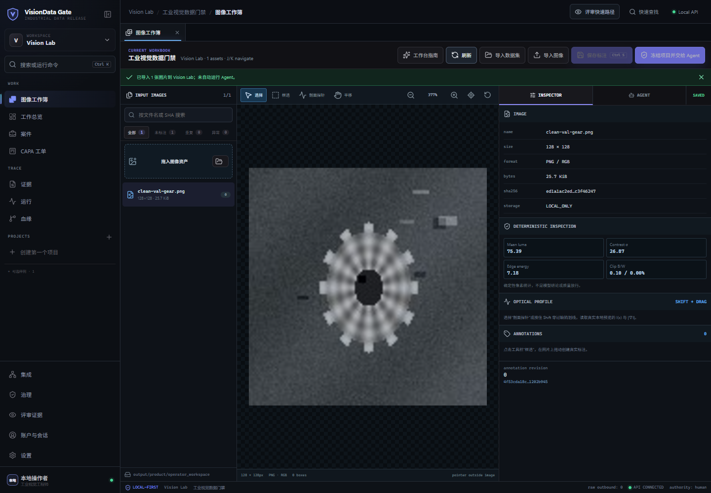
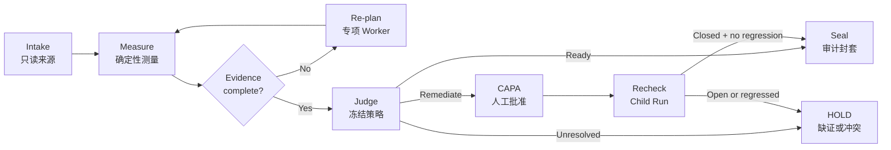

<p align="center">
  
</p>

<h1 align="center">VisionData Gate</h1>

<p align="center"><strong>让工业视觉图像走向可追责的结果</strong></p>
<p align="center">把图像、标注与工况证据，转成可复验、可追溯、由人最终负责的发布决策。</p>
<p align="center"><em>A governed evidence agent for industrial vision data readiness.</em></p>

<p align="center">
  <a href="https://github.com/dukeandBaron/visiondata-gate/actions/workflows/ci.yml"></a>
  <a href="LICENSE"></a>
  
  
  
  
  
  
</p>

<p align="center">
  <a href="docs/quickstart.md"><strong>Run Local Workbench</strong></a>
  ·
  <a href="https://dukeandbaron.github.io/visiondata-gate/"><strong>View Read-only Replay</strong></a>
  ·
  <a href="docs/quickstart.md"><strong>Quickstart</strong></a>
  ·
  <a href="docs/architecture.md"><strong>Architecture</strong></a>
  ·
  <a href="docs/api_reference.md"><strong>API</strong></a>
  ·
  <a href="benchmarks/README.md"><strong>Benchmarks</strong></a>
</p>

<p align="center">
  
  <br />
  <sub>本地版本连接受控 API、接受真实图片并保存项目状态；GitHub Pages 仅提供明确标注的只读证据回放。</sub>
</p>

## Why VisionData Gate

工业视觉模型的上线风险，往往在训练开始前就已经写进了数据：相似帧跨 Train/Val 泄漏、标注框整体偏移、换型后的曝光漂移，都可能与漂亮的离线分数同时存在。

传统脚本能跑检查，却难以处理证据冲突和工具故障；普通聊天式 AI 能给建议，却无法对测量值、版本、批准人与最终决定负责。

**VisionData Gate 是位于数据准备与模型发布之间的受控证据工作台。** 它让 Agent 负责理解、规划与协调，让确定性工具负责测量，让具名质量人员保留最终决定权。证据不完整时，系统进入 `DEFER`、`RECAPTURE`、`QUARANTINE` 或调查 `HOLD` 等失败关闭状态，不会为了走完流程制造 `PASS`。

| Hidden dataset risks | Brittle pipelines | Unaccountable AI |
|---|---|---|
| 发现曝光、清晰度、标注、泄漏和工况覆盖中的隐性风险。 | 证据冲突时按缺口增派 Worker；仅对合同允许重试的瞬态故障执行有界恢复，其余失败关闭。 | 审计工件绑定适用的来源、工具回执、冻结策略与 SHA-256；具名人工闸门未完成时明确保持待审批。 |

> VisionData Gate 治理的是“数据能否进入下一阶段”，不是替代缺陷检测模型，也不直接控制 PLC、MES 或相机。

## What You Can Do

| Product capability | What ships today |
|---|---|
| **Deterministic measurement** | 用清晰度/曝光、dHash/MAE、BBox/Mask、覆盖矩阵和 metadata 漂移等算子生成可引用测量工件。 |
| **Dynamic re-planning** | 展示被选与未选的 Worker（执行单元）、选择原因、触发证据、预算与工具回执；追加工作仅由已识别并绑定证据引用的缺口触发。 |
| **Bring Your Own Planner** | Provider Profile 与 Planner 通过窄合同解耦，支持 `off`、`shadow`、`gated`、`replay`；预算预检失败时走 0-call 确定性路径。 |
| **Sandboxed remediation** | Parent 数据版本保持只读；批准后的 CAPA 在派生版本执行，并由独立 Child Run 复验新增退化。 |
| **Tamper-evident audit** | 用 RFC 8785 JCS 与域分离 SHA-256 绑定 Case、Decision Packet、ToolTrace、GateResult 和 Outcome。 |
| **Human gatekeeper** | Agent 调查并提出建议；CAPA、根因认定与生产放行始终需要具名质量人员确认。 |

## One Governed Run



工作台把同一条闭环拆成四个可检查界面：

- **Evidence** — 图像预览、测点、异常坐标和原始工具回执（Tool Receipt）。
- **Plan** — Worker 选择、拒绝原因、触发证据和冻结预算。
- **CAPA & Lineage** — Parent → Human Approval → Derived Version → Child Run。
- **Governance** — LIVE/REPLAY 来源、强 ETag（并发版本标识）、内容 SHA-256 和最终权限边界。

状态缺失、摘要漂移、工具失败或并发版本过期都会返回类型化阻断状态，并区分可重试与不可重试。Review/Case 投影界面不会用 Incident 原始字段、静态 Fixture 或上一次 `PASS` 覆盖失败的 LIVE 读取。

## Run the Real Workbench

要求：Windows 10/11、Python 3.12、[uv](https://docs.astral.sh/uv/) 和 Node.js 22+。

```powershell
git clone https://github.com/dukeandBaron/visiondata-gate.git
cd visiondata-gate

.\setup_env.ps1
.\run_workbench.ps1 -Install
```

启动后打开 `http://127.0.0.1:4173/workspace`。这是连接本机 FastAPI 的真实工作台，不是预设回放：可以创建项目、上传单张图片或带 COCO / YOLO / VOC / LabelMe 标注的数据集，并继续生成分析、工单与受控 Agent 任务。上传字节保存在本地工作区，返回的资产回执包含服务端复算的 SHA-256。

服务入口：

- Workbench：`http://127.0.0.1:4173/workspace`
- API health：`http://127.0.0.1:8787/v1/health`
- OpenAPI：`http://127.0.0.1:8787/docs`

运行内置的隔离合成案件：

```powershell
.\run_demo.ps1 -Install
```

该入口会创建独立项目、验证 Manifest，并打开对应案件的审阅页。它不会连接生产设备，也不会把仍受阻的 Child Run 改写为生产 `PASS`。

不安装即可浏览 [公开只读回放](https://dukeandbaron.github.io/visiondata-gate/)。该站点固定为 `PUBLIC_SYNTHETIC_REPLAY`：无后端、无账户、无 API Key、无客户数据、无上传或写入能力。它用于检查产品流程与审计合同，不替代本地真实工作台。

完整安装、授权本地目录和 BYOP 配置见 [Quickstart](docs/quickstart.md)。当前发布的是可复现源码；已签名的桌面安装包尚未提供。

## Evidence, Not Claims

### DynamicBench-v3

冻结的 8 夹具协议在相同终态合同下覆盖证据冲突、可恢复工具故障、不确定性和正常路径。

| Metric | Dynamic planner | Fixed pipeline |
|---|---:|---:|
| Correct terminal state | **8 / 8** | 4 / 8 |
| Unsafe release | **0 / 8** | **0 / 8** |
| Recoverable tool faults handled | **2 / 2** | 0 / 2 |
| Total tool calls | **14** | 24 |
| Unnecessary calls | **0** | 14 |

Dynamic 路径减少 41.7% 工具调用，并保持相同的 fail-closed 安全底线。固定流水线的 4 个错误终态是保守 `HOLD`，不是误放行。完整记录、摘要与复现命令见 [Benchmarks](benchmarks/README.md)。

### Public industrial proxy

VisA 治理代理协议已在当前发布环境复算，并提供脱敏封存摘要：Dynamic 与 Fixed 的正确终态均为 `525/600`，unsafe release 均为 `0`；Dynamic 避免了 150 次已知无效重试。原始图像、Source Binding 与 Source Index 不随仓库分发，因此公开 checkout 本身不能独立重跑这 600 个 episode；取得并绑定合法数据后可按公开工具复算。该结果证明合同感知的恢复效率，不代表缺陷检测精度或工厂 KPI。

<details>
<summary><strong>Historical authorized offline pilot</strong></summary>

一个 180 样本的私域 Omni 子集曾在本地只读来源上完成 Gate → CAPA → Derived Version → Child Run：findings 从 `49` 变为 `33`，其中 `6 closed / 43 open`，最终处置为 `TRANSFERRED_TO_INVESTIGATION`，生产放行为 `false`。

公开仓不包含原始字节，因此不能现场重算。该记录不代表客户验收或工厂 ROI；误放行率、误拦截率与独立裁决后的整改通过率保持 `NOT_MEASURED_PENDING_ADJUDICATION`。

</details>

## Fits Your Existing Stack

VisionData Gate 通过合同接入现有流水线，不要求团队替换标注平台、模型或实验系统。

| Extension surface | Purpose | Current boundary |
|---|---|---|
| `skills/` | 定义输入、输出、权限与 evidence span 的工业工具 | 可扩展合同 |
| `rulepacks/` | 版本化阈值、策略与 fail-closed 规则 | 本地加载 |
| `schemas/` | Evidence、Receipt、Decision 与 Lineage DTO | JSON Schema |
| CVAT / FiftyOne | 整改导出、修订回传与同合同复验 | 本地合同已验证；外部服务未连接 |
| Provider Profiles | Workspace 级 BYOP 配置与连接探测 | 密钥仅留在服务端 |
| AgentTeams transport | Local / Hosted 调度边界 | 不继承生产权限 |

MES、OPC UA、PLC、VisionMaster 和 Hosted Transport 在取得真实身份、端点与探测回执前始终显示 **not connected**。接口存在不等于现场部署完成。

## Security by Construction

1. **Raw pixels stay local by default.** 核心合同固定 `raw_images_transmitted=false`；公开资产排除私域图像、绝对路径、凭据与操作者回执。
2. **No machine write-back.** `machine_write_permitted=false`；当前实现不能写入 PLC、MES、相机或生产设备。
3. **Humans own the final decision.** `production_decision_authority=human_only`；缺证时始终 fail closed。

Provider Key 由本地服务保存且不会通过 API 回显。SHA-256 用于内容身份与篡改检测，不是数字签名或可信时间戳。详见 [Security](SECURITY.md)、[Compliance](docs/compliance.md) 和 [Audit Envelope](docs/audit_envelope.md)。

## Repository Map

```text
visiondata-gate/
├── src/visiondata_gate/   # governed runtime, API, evidence and audit contracts
├── web/                   # React 19 industrial workbench
├── desktop/               # Tauri 2 desktop shell
├── skills/                # bounded industrial Skill contracts
├── rulepacks/             # versioned governance policies
├── schemas/               # portable JSON contracts
├── benchmarks/            # reproducible public evidence
├── sample_data/           # privacy-safe synthetic fixtures
├── tests/                 # runtime, API, safety and publication contracts
└── docs/                  # quickstart, architecture, API, compliance and audit
```

## Contributing

Issues and focused pull requests are welcome. Start with [CONTRIBUTING.md](CONTRIBUTING.md); security-sensitive reports belong in [SECURITY.md](SECURITY.md), not a public issue.

---

<p align="center">
  <a href="docs/quickstart.md">Get Started</a>
  ·
  <a href="docs/architecture.md">Architecture</a>
  ·
  <a href="docs/api_reference.md">API</a>
  ·
  <a href="benchmarks/README.md">Benchmarks</a>
  ·
  <a href="LICENSE">Apache-2.0</a>
</p>
