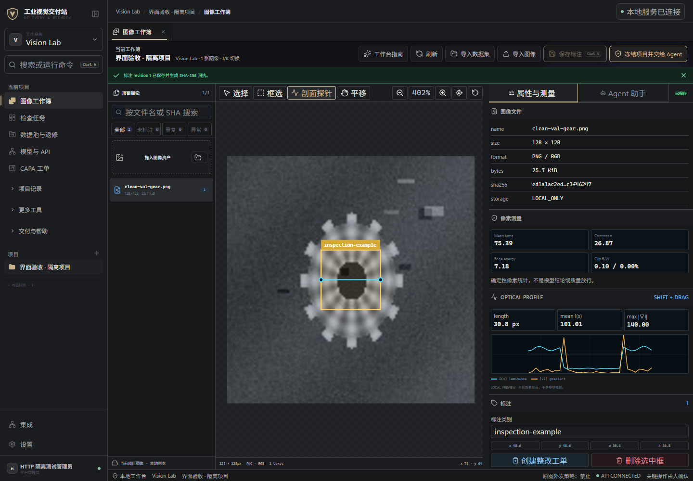
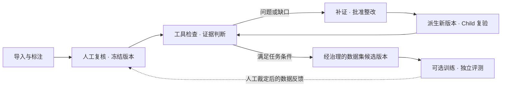
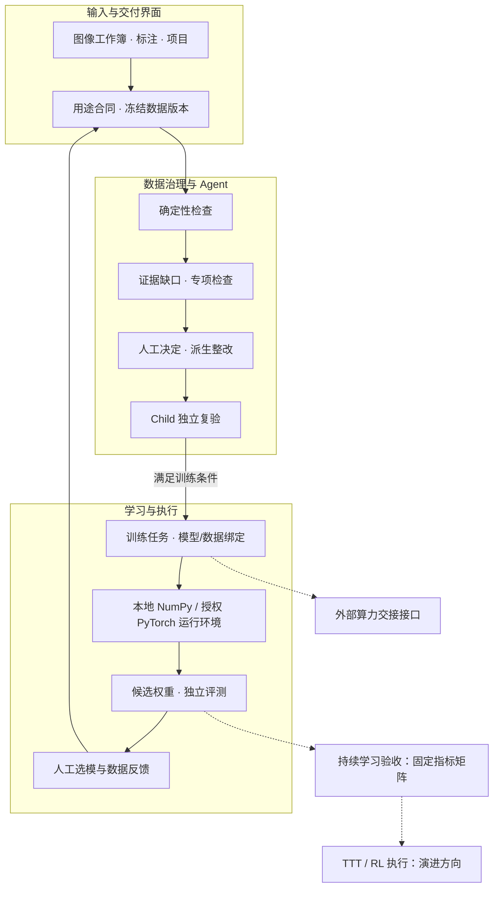

<p align="center">
  
</p>

<h1 align="center">VisionData Gate</h1>

<p align="center">
  <strong>让每一版视觉数据，都有依据地进入下一步。</strong><br />
  工业视觉训练数据的准入、整改复验与模型迭代工作台
</p>

<p align="center">
  <a href="LICENSE"></a>
  
  
  
</p>

<p align="center">
  <a href="https://dukeandbaron.github.io/visiondata-gate/">在线 Demo</a> ·
  <a href="https://dukeandbaron.github.io/visiondata-gate/#/workspace">试用图像工作簿</a> ·
  <a href="https://github.com/dukeandBaron/visiondata-gate/releases">Windows 下载</a> ·
  <a href="#quickstart">本地运行</a> ·
  <a href="#docs">开发文档</a>
</p>

**像代码合入前需要 CI，视觉模型训练与版本交付前也需要一个能拒绝放行的数据门禁。** VisionData Gate 帮助算法工程师、视觉方案商和数据质量负责人，把“一批数据有问题”推进到“问题有处理、修订有版本、结果有复验”。

它工作在工业视觉的**数据准备与模型交付环节**：工具负责测量，Agent 组织补证与下一步任务，人保留关键决定权。

<p align="center">
  
  <br />
  <sub>真实本地工作簿截图，使用公开合成样本；框为人工标注，曲线为像素量测。</sub>
</p>

## 三种入口，对应三种证据

| 入口 | 评审者实际能做什么 | 证据边界 |
| --- | --- | --- |
| **在线图像工作簿** | 更换自己的图片，复算 SHA、亮度、清晰度、同会话字节重复；人工框选并导出 JSON | 浏览器当前标签页；不上传、不创建后端案件、不生成生产 PASS |
| **冻结 Agent 案件** | 查看触发证据、Worker 选择／拒绝、竞争假设、预算、CAPA 血缘和六阶段 Trace | SHA 绑定的合成回放；不冒充当前上传图片的 Agent 结果 |
| **本地完整工作台** | 使用账户、项目和持久化 API，执行具名决定、派生整改、Child Run 与支持的模型任务 | 本机受控运行；工厂接入、客户验收和生产授权需另行取证 |

[按核验路径打开 Demo](https://dukeandbaron.github.io/visiondata-gate/#/review) · [现场改变输入与复现](docs/LIVE_REPRODUCTION.md)

## 为什么是数据交付，而不只是再训练一次

**指标很好，数据却可能泄漏。** 同一张图进入 train 与 val，或同分区重复堆积，都可能扭曲训练和评测；图片能打开，并不代表可以这样使用。

**标注改了，返修却没有结束。** 外包返修、换型补采和多人交接需要核对图片、标签、用途与版本；“已处理”还需要新一轮检查确认。

**一条建议，不是一份交付。** 遇到缺失证据、工具失败或相互冲突的判断，用户需要知道下一步查什么、谁来确认，以及哪些问题仍然开放。

VisionData Gate 把这些工作组织成可重复的流程。**带有真实缺陷、标注正确的图片可能是优质训练材料；正常产品的模糊图片也可能不适合当前任务。**

## 为什么需要 Agent，而不是把脚本串得更长

已知、稳定、无冲突的 SOP 应该交给固定工具。项目的 ArchBench-v2 也得到这一负结论：固定 SOP 下，传统流程、单 Agent 与多 Agent 质量持平，增加角色本身没有价值。

Agent 只处理固定脚本难以预写的部分：中间证据发生冲突、工具失败、出现新证据或预算不足时，判断缺什么证据、选择哪一个专项 Worker、何时停止并请求人工决定。DynamicBench-v3 在相同输入、工具和 Fail-Closed Judge 下验证了这一边界；它证明编排完整性与效率，不声称多 Agent 普遍更强。

## 在工作台里完成一轮任务

| 能力 | 用户可以做什么 | 系统留下什么 |
| --- | --- | --- |
| **图像工作簿** | 导入图片、人工框选、保存标注、查看亮度与剖面 | 原图身份、标注版本和量测依据 |
| **确定性质检** | 检查清晰度、曝光、重复与泄漏、标注结构、覆盖情况 | Finding、测点、阈值与工具回执 |
| **按证据补查** | 在 Incident 案件中查看竞争假设、缺口和 Worker 选择／排除原因 | 计划、执行记录、待补证项与停止原因 |
| **整改与复验** | 人工确认操作，在派生版本处理，再执行 Child Run | 父子版本、持续问题、新增问题和关闭依据 |
| **模型迭代** | 登记可信权重与运行环境，执行支持的候选训练，复核模型反馈 | 数据版本、父模型、候选权重与评测关联 |
| **团队交接** | 管理账户、工作区、项目权限与具名决定 | 操作归属、审批与可追溯交付记录 |

<a id="workflow"></a>

## 从发现问题，到验证下一版



原始输入保留，整改在派生版本进行；Child Run 重新检查，而不是修改父版本的结果。模型错误先经过人工分类，再决定返修标注、补采工况或补充训练材料。验证集和测试集不会自动回灌训练。

**有两种回退，而不只是“再跑一遍”：**证据不足或诊断需要修订时，进入 `DIAGNOSIS_REVISION`；整改无效、问题持续或引入回归时，进入 `REMEDIATION_REVISION`。

<a id="agent"></a>

## Agent 如何承担这段工作

Agent 根据当前任务和证据组织下一步，专业工具执行可复算的检查。你可以查看它选择了谁、排除了谁、调用了什么，以及为什么暂停。

- **任务与工具分离**：检查由明确的输入、输出与权限合同约束；工具失败会进入结果，不被替换为文字上的成功。
- **选择与执行分离**：Worker 选择理由不冒充执行结果，后续调用保留独立回执。
- **模型与裁决分离**：外部 Planner 可配置 off／shadow／gated／replay；只有允许的建议影响规划，不能代替人员批准。
- **经验与当前证据分离**：历史参考按准入、作用域和时效使用，不取代当前测量。

单图取证、冻结批次检查与 Incident 调查是不同执行路径；不是每次上传都会调用 LLM 或动态增派 Worker。[查看 Agent 架构](docs/AGENT_PLATFORM.md) · [配置外部 Planner](docs/INCIDENT_MODEL_PLANNER.md)

<a id="verification"></a>

## 用结果说明，而不是只展示一次成功

[**Benchmark Suite：查看完整实验体系**](benchmarks/README.md) — 从固定流程与多 Agent 的架构对照，到调度稳定性、动态补证和真实产品运行时桥接。每项实验都有自己的验证问题、实现入口和结果口径。

### 动态补证：相同输入下比较编排方式

作者定义并冻结的 **DynamicBench-v3** 包含 8 个合成场景，覆盖证据冲突、工具故障、不确定性和新证据。

| 指标 | 固定规则基线 | 动态重规划 |
| --- | ---: | ---: |
| 正确终态 | 4 / 8 | **8 / 8** |
| 工具调用总数 | 24 | **14** |
| 工具失败恢复 | 0 / 2 | **2 / 2** |
| 不安全误放行 | 0 / 8 | 0 / 8 |

动态策略在该协议中减少了 **41.7%** 的工具调用。固定基线的错误是保守阻断，不是误放行。该实验衡量编排完整性与效率，外部模型调用为 0，不是工厂准确率或外部 Agent 排名。[协议与完整结果](docs/DYNAMICBENCH_V3.md)

### 授权离线试跑：数量下降，不代表责任全部关闭

Omni 授权离线试跑的历史记录中，派生版本包含 **180 张图像、60 个 Mask**；Child Run 的 Finding 从 **49 降到 33**，但逐项责任核验仅确认 **6 条关闭、43 条仍开放**，最终转入人工调查。

这说明系统能保留整改和复验的真实负结果。它不是工厂在线 shadow test，也不替代独立真值上的误放行、误拦截指标。[数据与实验边界](docs/EVIDENCE_AND_BENCHMARKS.md)

<a id="quickstart"></a>

## 现在开始使用

### 在线体验：无需安装

[打开在线 Demo](https://dukeandbaron.github.io/visiondata-gate/) 或 [直接进入图像工作簿](https://dukeandbaron.github.io/visiondata-gate/#/workspace)。

在浏览器中选择图片，计算文件哈希和像素读数、识别字节重复、人工框选并导出本地 JSON；图片留在当前标签页，不上传服务器。下方合成案件用于独立查看计划、证据与复验结构。

**在线站点没有业务后端。**需要账户、持久保存、真实 Agent 执行和整改写操作，请运行下方本地工作台。

### 本地完整工作台

准备 Python 3.12／3.13、[uv](https://docs.astral.sh/uv/)、Node.js 22.12+ 和 Git：

```text
git clone https://github.com/dukeandBaron/visiondata-gate.git
cd visiondata-gate
uv sync --extra api --extra qa --locked
npm --prefix web ci
uv run python tools/run_cross_platform_workbench.py --check
uv run python tools/run_cross_platform_workbench.py
```

首次打开创建管理员，随后建立工作区与项目，从 [公开合成样本](sample_data/README.md) 开始。确定性数据检查不要求 GPU 或外部模型 Key。[启动与排错](docs/CROSS_PLATFORM_QUICKSTART.md)

### Windows 桌面

[下载带版本说明与验证回执的 Windows 候选包](https://github.com/dukeandBaron/visiondata-gate/releases)。核心工作台内嵌运行组件；可选 Python／Torch／Ultralytics／权重需另行登记。安装器未签名，WebView2 为前提，干净机与升级验收按具体包记录。[安装指南](docs/WINDOWS_INSTALLER.md)

最新本地候选身份为 [`windows-local-ca1fa7b-20260915`](https://github.com/dukeandBaron/visiondata-gate/releases/tag/windows-local-ca1fa7b-20260915)，安装器 SHA-256 为 `09468a0d148017717b2932fc940f17caa378e46fef88ededf582accfea6d05f0`。它已完成构建/PYZ 绑定、提取态 120 次网关请求、两轮 packaged-learning、实际安装启动、SQLite 检查，以及不启用 DevTools 的 Tauri 登录注册 GUI 验收；独立干净机、签名和工业效果仍为 HOLD。[查看完整候选证据](docs/WINDOWS_CANDIDATE_CA1FA7B_20260915.md)

<a id="architecture"></a>

## 开放、可组合的工程底座

技术路线分为**人机协同数据集冷启动 → Agent 编排的数据质量治理 → 受控模型开发与反馈回流**。三阶段共享任务身份与证据，但不同模型分支保留自己的执行和评测合同。



图中为模块关系，不表示所有模型分支已在同一个案例中贯通；虚线表示交接、独立验收或演进接口。[完整技术路线：数据流、Agent、损失、参数更新与算力](docs/PROJECT_TECHNICAL_OVERVIEW.md)

- **工作台**：React／TypeScript；Tauri 提供桌面外壳。
- **业务服务**：FastAPI 承接领域逻辑；桌面 Spring WebFlux 网关处理本地代理与健康检查。
- **数据与证据**：SQLite、文件工件、JCS 规范化与域分离 SHA-256。
- **扩展入口**：REST API、Schema、Rule Pack、Adapter，以及显式版本注册的工业 Skill SDK。
- **学习路径**：CPU 参考闭环、检测框训练、Normality 异常检测与持续学习验收各自说明范围；TTT／RL、VLM 预标注和 Active Learning 不作为已完成能力。

[公共 API](docs/PUBLIC_API.md) · [工业 Skill SDK](docs/INDUSTRIAL_SKILL_SDK.md) · [可运行复用示例](examples/reuse/README.md) · [术语与合同](docs/TECHNICAL_TERMINOLOGY.md)

[现场与第三方复现](docs/LIVE_REPRODUCTION.md) · [自研贡献与 AI 辅助开发说明](docs/DEVELOPMENT_PROVENANCE.md)

<details>
<summary>实现细节：训练输入与安装交付保护</summary>

YOLO 训练预算在 API、Schema、Web 和执行器统一为 **10–600 秒**；训练冻结拒绝**同一分区的字节重复或解码像素重复**，执行前进行磁盘空间预检，失败、取消与超时保留任务证据。

安装构建器将 `BUILD_MANIFEST.json`、`SOURCE_MANIFEST.json`、`DELIVERY_STATUS.json` 和 `SHA256SUMS.txt` 与安装器放在同一目录。构建完成与安装验收是不同状态。

源码 `ca1fa7b1727535014e8723e5bceb4d539272cf2b` 已据此生成并验证 Windows 候选；后续 README 或发布清单提交不会自动进入该二进制。

[视觉模型合同](docs/VISION_MODEL_API_CONTRACT.md) · [任务存储与保留](docs/MODEL_JOB_RETENTION.md)

</details>

## 数据、安全与许可证

原始数据与业务记录保存在选定的本地目录；外部模型由用户显式配置。图像上传、具名审批和模型加载具有独立权限，设备写入和自动生产放行不属于本项目权限。

项目原创代码使用 **[Apache-2.0](LICENSE)**，不是 MIT。允许按许可证条件使用、修改和分发，包括商业用途；应保留适用的许可证及版权声明。第三方库、模型和权重仍遵循各自协议，特别是可选 Ultralytics 的 AGPL／Enterprise 条款，不能由本项目许可证替代。

[安全报告](SECURITY.md) · [数据与公开边界](docs/PUBLICATION_BOUNDARY.md) · [第三方声明](docs/THIRD_PARTY_NOTICES.md) · [SBOM](docs/SBOM.cdx.json) · [NOTICE](NOTICE)

<a id="versions"></a>

## 持续演进

项目从批次质量检查，演进到案件补证与派生复验，再扩展到图像工作簿、模型反馈和桌面交付。近期 `windows-local-ca1fa7b-20260915` 已把训练输入去重、预算一致性、任务存储保护、安装器源码绑定和发布版 UIA 登录验收收口到同一候选；证据见 [ca1fa7b Windows 候选](docs/WINDOWS_CANDIDATE_CA1FA7B_20260915.md)。

软件版本、源码提交、模型版本和安装构建各自标识，不让旧结果替新版本背书。[版本演进](docs/VERSION_EVOLUTION.md) · [CHANGELOG](CHANGELOG.md) · [当前验证与交付状态](docs/README_STATUS_AND_EVIDENCE.md)

<a id="docs"></a>

## 参与项目

欢迎贡献数据格式适配、工业 Skill、标注往返、失败恢复与可复现实验。请通过 [Issues](https://github.com/dukeandBaron/visiondata-gate/issues) 提交最小合成案例，或阅读 [贡献指南](CONTRIBUTING.md) 开始开发。

**请勿在 Issue、PR 或公开附件中上传客户图像、个人信息、密钥或私有运行回执。**

[复现实验](docs/BENCHMARK_REPRODUCIBILITY.md) · [开发质量检查](docs/ENGINEERING_QUALITY_IMPLEMENTATION.md) · [软件引用](CITATION.cff)
