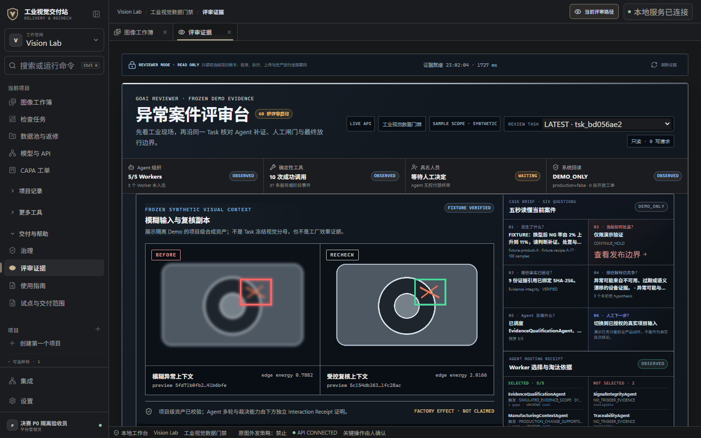

# 决赛任务完成 UI：责任、回读与恢复

状态：`IMPLEMENTED_AND_LOCALLY_VERIFIED / NOT_YET_IN_WINDOWS_CANDIDATE`

这组界面改动将已有的 Agent、确定性工具、具名人工决定与结果回读压缩为连续任务链。它不新增 Agent 内核、模型、工厂连接或生产权限。



截图使用隔离合成 ProductRoot 和本地 API；不是客户数据、工厂在线结果或生产放行证据。

## Review：四类责任

Review 首屏只从当前 Task 已持久化事实生成四段责任条：

- `Agent 组织`：Worker 选择、未入选数量与预算；
- `确定性工具`：服务端 Tool/Event；
- `具名人员`：人工回执与待决状态；
- `系统回读`：Release Readiness 与开放工单。

缺失事实显示 `UNKNOWN` 或 `WAITING`。`OBSERVED` 只代表事实被读取，采用中性色，不代表成功。

## CAPA：动作与回读分离

CAPA 将原先重复的流程格替换为：

```text
NOT REQUESTED
→ REQUEST SENT / UNKNOWN
→ SERVER VERIFIED
→ CHILD / OUTCOME READBACK
```

写请求结果未知时，不自动重放 POST，只允许显式 GET 对账；只有同一 Task 的 CAPA、Child 与 Outcome 事实完成作用域和摘要核验，才推进回读状态。回读完成不等于生产放行。

## Runs：失败后下一步

Runs 对 `WAITING / UNKNOWN / BLOCKED / HUMAN REVIEW` 显示“为什么停、现在能做什么、禁止做什么”：

- 活跃任务只刷新事件，不创建重复 Task；
- 部分事实不可用时只重新 GET；
- `FAILED` 转 Agent Platform 核验执行归属；
- `BLOCKED_GATE_DECISION` 转绑定 Task 的 CAPA；
- `BLOCKED_SOURCE_STALE` 转来源授权；
- `BLOCKED_EVIDENCE_INTEGRITY` 转证据清单；
- `READY_FOR_HUMAN_REVIEW` 使用待办色，不显示为最终 PASS。

## 同轮浏览器修复

真实本地浏览器验收还发现并修复了两类问题：

1. 登录名 HTML `pattern` 在现代浏览器 Unicode Sets `v` 规则下无效；现在使用显式转义的连字符；
2. 侧栏品牌副标题、工作空间标签、样例入口和账户角色的对比度不足；现在统一使用 `--muted-2`。

Review 内嵌的案件简报和 Claim Boundary 也改为非嵌套 complementary landmark，避免无效的 `aside` 层级。

## 验证

### 构建与自动化

```text
npm run check
PASS · TypeScript + Vite production build · 1919 modules

P0/Review/Identity 定向测试
51 passed · 1 dependency deprecation warning

P0 浏览器组件测试
3 passed · 0 failed

连续全仓回归
2105 collected · 2081 passed · 24 skipped · 0 failed · 17 warnings
```

24 项 skip 对应未随公开仓分发的历史私有发行输入、当前 Windows 用户无 symlink 权限和未授权外部 YOLO 运行时；这些能力没有计入 PASS。

### 真实本地浏览器 affected-slice

范围：本地登录、工作空间、合成项目、Task Review、责任条、Command Center 下钻和桌面布局。

```text
Console errors/warnings       0
Page errors                   0
Network 4xx / 5xx             0 / 0
axe Critical / Serious        0 / 0
CLS                           0.1975  (< 0.25)
INP                           176 ms  (< 500 ms)
责任条下钻                     69 ms
```

在 `1920 / 1440 / 1280 / 1024 × 900` 下：

- 页面横向溢出 0；
- 责任条 4 项全部可见；
- 竖排文字候选 0。

LCP 未在该 SPA affected-slice 中取得可靠条目，因此完整全站 UX 裁决仍为 `INCOMPLETE`；本页只声明受影响路径已验证。

## 权限与证据边界

```text
production_release_allowed=false
machine_write_permitted=false
customer_validation=NOT_CLAIMED
factory_connection=NOT_CLAIMED
```

源码 UI 通过不自动升级既有 Windows 二进制。必须从包含本改动的精确提交重新构建和验证安装器，才能声称 Windows 候选包含这组界面。
