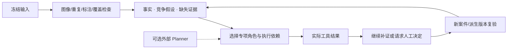
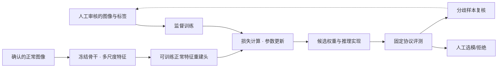
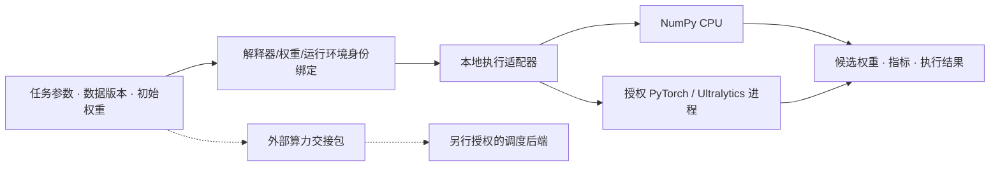

# VisionData Gate 技术总览

本页把图像、标注、Agent、模型学习和算力接入放在同一张技术地图中。对应源码模块可以复用，但各模型分支的运行证据独立；图中没有将 TTT/RL 设计接口写成已执行的训练算法。

## 1. 数据如何进入系统

**图像＋标注＋采集组/工况 → 用途确认 → 人工复核 → 冻结数据版本。**

图像身份、annotation revision、标注文档摘要、用途和 train/val/test 划分共同确定输入。缺少标注不等于正常；显式正常声明与二值 Mask 学习副本有单独合同。真实缺陷图像可以是有价值的学习材料。

主要入口：[operator_workspace.py](../src/visiondata_gate/operator_workspace.py)、[operator_snapshot.py](../src/visiondata_gate/operator_snapshot.py)、[learning_detection_dataset.py](../src/visiondata_gate/learning_detection_dataset.py)。

## 2. Agent 怎么推进任务

选择以资格、阻断级别、假设区分、证据缺口、成本档与稳定顺序为依据。未知成本保留 UNKNOWN，不宣称已求得成本最优。外部 Planner 的 off/shadow/gated/replay 权限不同；角色选择记录不等于角色已经执行。

必须区分两类 Child：

- **Child Case**：在具名决定与新证据下继续调查，不自动等于 CAPA 已执行。
- **Child Run**：对派生数据按合同重新检查，报告持续项、新增项与关闭依据。

两种反馈分别是诊断修订 `DIAGNOSIS_REVISION` 与整改修订 `REMEDIATION_REVISION`。详见[技术术语](TECHNICAL_TERMINOLOGY.md)、[Agent 平台](AGENT_PLATFORM.md)。

## 3. 模型如何学习，计算由谁执行

### 3.1 标注驱动学习

通用关系是 `L_sup = loss(f_theta(x), y)`，再由具体优化器更新可训练参数。该表达不是所有模型采用同一损失的承诺。

| 分支 | 实际学习对象 | 执行与产物 |
|---|---|---|
| CPU 参考学习 | 六个权重，特征为 R/255、G/255、B/255、x、y、bias | NumPy 全批梯度下降；JSON 权重；二值像素预测 |
| YOLO detect | 按明确架构初始化或可信登记权重训练检测模型 | 外部授权 Ultralytics/PyTorch 进程；候选 checkpoint、验证结果 |
| Normality | 冻结 YOLO26n-cls 骨干，训练层 4/6/9 的特征重建头 | 多尺度正常性参考；异常分数与 64×64 异常图 |

参考学习器的实际损失为平均二元交叉熵加非偏置权重的 L2 项：`L = mean(BCE) + l2/2 * sum(w_nonbias²)`。这是真实梯度更新，不是强化学习。检测训练的具体损失由锁定模型实现决定，不在说明图里虚构固定 loss 配方。

Normality 的正常图像训练、阈值校准与留出开发评测分开。异常图是模型评分的空间表达，不是概率真值，也不意味着标签自动修好了。

### 3.2 执行适配与算力

图像质量检查的“业务工具”与训练中的“张量算子”不是同一层。矩阵运算、特征提取、损失和梯度由对应计算框架执行；项目负责输入绑定、权限、预算、取消、状态及工件回收。

现有外部算力交接状态为 `PREPARED_NOT_SUBMITTED`，不等于 CANN/NPU 作业已提交成功。TTT 和 RL 也不能仅靠提供交接接口就自动成立。

实现入口：[learning_engine.py](../src/visiondata_gate/learning_engine.py)、[learning_yolo_backend.py](../src/visiondata_gate/learning_yolo_backend.py)、[normality_inference.py](../src/visiondata_gate/normality_inference.py)、[compute_handoff.py](../src/visiondata_gate/compute_handoff.py)。

## 4. 一轮结果怎样进入下一轮

模型分歧先经人工分类：标签复核、困难样本候选、新工况或信息不足。处理后形成新的图像/标注版本，再经过检查与训练准入；不能把 val/test 的错误样本自动搬到 train。

父模型保持可追溯。候选生成、评测通过、人审选模与生产批准分别记录；不满足条件时保留父模型。参考学习闭环和 detect 续轮已有各自运行路径；Normality→CAPA→后续训练的完整同链仍需接通和验证。

### 持续学习与遗忘

现有模块校验父/候选模型、保留集、学习顺序及提交的阶段指标矩阵。对越高越好的指标，遗忘为 `max(history) - final`，负数截断为 0；同时检查平均遗忘、最坏物件和最终绝对门槛。

这是一套**验收与选模门禁**，并不自行证明矩阵中的真实训练已经发生。Replay 数量/教师链的合同检查不是实际执行蒸馏损失。

### TTT 与 RL 的位置

- **TTT/持续适应设计**：新工况筛选→适应目标→Head/Adapter 更新→旧物件复验。实际适应执行和真实多物件顺序实验未完成。
- **RL 策略学习设计**：以证据、缺口和预算为状态，学习检查/补证/标注/停止等动作的选择。当前没有奖励驱动策略训练闭环，不将人工反馈直接称为 RLHF。

详见[持续学习验收](CONTINUAL_LEARNING_RETENTION.md)、[学习反馈工作台](QUALITY_LEARNING_WORKBENCH.md)。

## 5. 共享底座与部署形态

所有分支共享身份/项目作用域、数据版本、模型身份、JCS/SHA 工件及人工决定。摘要用于完整性核对，不代替标签语义、独立评测或数字签名。

| 入口 | 实际职责 |
|---|---|
| 在线 Pages | 浏览器本地图像处理＋冻结合成回放；无业务 API |
| 本地 Web | 浏览器连接真实本地服务，使用账户、项目与持久化业务 |
| Windows 桌面 | React/Tauri 加本地网关和 Python 后端；能力按具体包与环境验收 |
| 完整在线后端 | 需要服务器、HTTPS、用户存储隔离与受控执行环境；尚未部署 |

返回 [README](../README.md) · [在线 Demo](https://dukeandbaron.github.io/visiondata-gate/)
