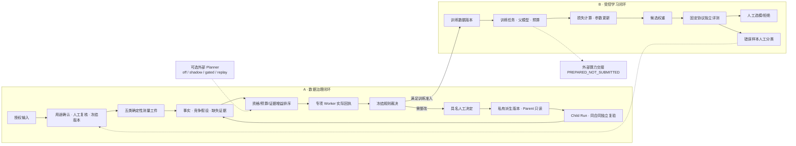

# VisionData Gate 技术路线

> 一项工业视觉数据交付任务，两条受控闭环：先把数据问题办到可复验，再决定是否进入模型迭代。

本页是当前技术路线的统一入口，按源码事实说明数据如何流动、Agent 如何选择工具、CAPA 如何产生 Child、训练如何计算损失与更新参数，以及哪些能力仍未实现。它不是自动生产质检系统，也不把 TTT／RL 的设计位置写成已经完成的训练结果。

## 1. 产品位于哪一段流程

VisionData Gate 位于**图像／标注交付之后、模型训练或版本发布之前**。目标用户是视觉方案商的算法与交付团队、数据质量负责人和具备最终责任的复核人员。

输入不是一张孤立图片，而是一份带用途的任务：图像、标注、采集组／工况、train／val／test 划分、规则版本和责任人。输出也不是一句建议，而是以下三种可交接结果之一：

- 当前版本满足本任务的技术准入条件；
- 当前版本需要具名人员批准一项受限整改，再由 Child Run 独立复验；
- 证据仍不足或责任仍开放，保持 HOLD／RECAPTURE 并交给调查。

数据 Gate 只决定当前数据版本能否进入下一步，不替代产线质量判定、根因认定或生产放行。

## 2. 总体拓扑：数据闭环与学习闭环

实线表示当前已有明确本地合同或执行路径；虚线表示受控建议、反馈回流或外部交接。两条闭环共享工作区、项目、数据版本、任务身份和审计工件，但不能把不同 Run 的结果拼成一次成功。

## 3. 数据面：先固定输入，再产生可复算事实

冻结版本由图像字节身份、annotation revision、用途、划分、规则和复核信息共同确定。缺少标注不等于正常；显式正常声明、必需标注和二值 Mask 学习副本使用不同合同。

| 测量工件 | 实际回答的问题 | 典型实现 |
| --- | --- | --- |
| 图像质量 | 是否可解码、模糊、欠曝或过曝 | 解码、亮度比例、Laplacian 方差 |
| 重复与泄漏 | 同分区是否重复、跨分区是否存在相同或近似样本 | SHA／dHash／MAE 与划分身份 |
| 标注完整性 | BBox／Mask 是否存在、结构是否合法、尺寸与图像是否一致 | 几何与 schema 校验 |
| 工况覆盖 | 类别、采集组与工况组合是否缺失或极不均衡 | 冻结覆盖矩阵 |
| 元数据漂移 | 相机、尺寸、命名和批次字段是否偏离合同 | 元数据 profile 与规则包 |

工具只提交测量、阈值、Finding 和回执，不确立业务根因。实现入口：[tools.py](../src/visiondata_gate/tools.py)、[duplicates.py](../src/visiondata_gate/duplicates.py)、[annotations.py](../src/visiondata_gate/annotations.py)、[coverage.py](../src/visiondata_gate/coverage.py)。

## 4. Agent 控制面：状态机、编排和模型各自负责什么

### 4.1 六阶段运行时

`INTAKE → PLANNER → TOOL → COUNCIL → JUDGE → DELIVERY`

- **状态机**限制哪些跃迁允许发生，拒绝阶段乱序、重复交付、工具失败后伪造 PASS 等非法结果。
- **Planner**根据现有事实、竞争假设、缺口、资格、预算和稳定排序选择专项 Worker。
- **Worker**执行确定性工具或受控适配器，返回独立 Tool Receipt；被选择不等于已执行。
- **Council／Judge**聚合支持与冲突，由冻结策略作门禁裁决；模型文本不能覆盖工具事实。
- **Delivery**输出 DecisionPacket、责任队列和证据引用，不授予设备写权限。

关键实现：[agent_core.py](../src/visiondata_gate/agent_core.py)、[industrial_incident.py](../src/visiondata_gate/industrial_incident.py)、[incident_agent_kernel.py](../src/visiondata_gate/incident_agent_kernel.py)、[worker_selection.py](../src/visiondata_gate/worker_selection.py)。

### 4.2 为什么不是固定脚本或“全量跑所有工具”

固定 SOP 适合已知、稳定且没有中间冲突的检查。项目先用 ArchBench-v2 得到一个负结论：在固定 SOP 下，传统流程、单 Agent 和多 Agent 的质量持平，因此不把“角色更多”当成优势。

只有当中间证据会改变后续任务时，动态编排才有必要。DynamicBench-v3 在相同输入、工具预算和 Fail-Closed Judge 下比较两种编排：动态策略得到 8／8 正确终态，固定策略 4／8；工具调用为 14 对 24，双方不安全误放行均为 0。它验证补证完整性、失败恢复和调用效率，不是工厂准确率或外部 Agent 排名。

### 4.3 两种修订回路

- `DIAGNOSIS_REVISION`：现有解释不足，新证据改变假设或下一项检查，回到补证。
- `REMEDIATION_REVISION`：整改无效、问题持续或出现回归，保留原方案结果并调整整改。

这两种回退都不是简单重跑；新的 Case／Run、输入身份、决定和摘要必须重新绑定。

## 5. 人工闸门、CAPA 与 Child

具名人员批准的是**具体版本上的具体动作**，不是笼统授权。Parent 保持只读，系统在目标卷内构建 staging 派生树，回读 manifest／receipt 后以不覆盖目标的目录重命名发布；复制中断时不暴露半成品最终目录。

必须区分：

- **Child Case**：带着新证据继续调查，不代表 CAPA 已执行；
- **Child Run**：对派生数据按同一合同重新测量，分别报告持续项、新增项和满足关闭条件的责任项；
- **Finding 变少**：只是观测数量变化，不自动等于根因成立、责任关闭或生产恢复。

实现入口：[capa.py](../src/visiondata_gate/capa.py)、[incident_commands.py](../src/visiondata_gate/incident_commands.py)、[incident_decision_packet.py](../src/visiondata_gate/incident_decision_packet.py)、[governed_outcome.py](../src/visiondata_gate/governed_outcome.py)。

## 6. 模型如何学习，计算由谁执行

训练只接收通过授权、用途、划分隔离和准入检查的数据版本。任务绑定父模型／初始化架构、参数、预算、解释器、依赖和输出目录；训练完成不等于候选模型被接受。

| 分支 | 当前真实执行 | 损失与参数更新 | 当前边界 |
| --- | --- | --- | --- |
| CPU 参考学习 | NumPy 六权重二值像素模型，两轮 HTTP 参考流程 | `mean(BCE) + l2/2 × Σw_nonbias²`，全批梯度下降 | 证明数据／模型／评测／人审合同，不是工业模型或 RL |
| YOLO detect | 受权环境中的 Ultralytics／PyTorch 子进程 | 由锁定模型实现计算检测损失与优化器更新 | 权重、环境、预算与 checkpoint 需逐次登记；第三方许可证单独适用 |
| Normality | 冻结 YOLO26n-cls 骨干，训练多尺度特征重建头 | 正常特征目标、候选头、阈值校准与留出评测分开 | 异常热图不是概率真值，Normality→CAPA→续训的同一链尚未贯通 |

评测比较目标缺陷、旧物件保留、速度／资源和绝对门槛；不满足条件就保留父模型。错误样本先由人分类为标签错误、困难样本、新工况或信息不足，再产生下一版数据任务；val／test 不自动回灌 train。

实现入口：[learning_service.py](../src/visiondata_gate/learning_service.py)、[learning_engine.py](../src/visiondata_gate/learning_engine.py)、[learning_yolo_backend.py](../src/visiondata_gate/learning_yolo_backend.py)、[normality_inference.py](../src/visiondata_gate/normality_inference.py)。

### 持续学习、TTT 与 RL 的准确位置

- 现有持续学习模块能校验父／候选模型、保留集、学习顺序和提交的阶段指标矩阵，并计算平均遗忘、最坏物件与最终门槛；它是**验收和选模门禁**，不是自动多任务训练器。
- TTT／持续适应当前只有“新工况筛选→适应目标→Head／Adapter 更新→旧物件复验”的设计位置；真实顺序适应实验未完成。
- RL 当前只有“状态=证据／缺口／预算，动作=检查／补证／标注／停止”的研究位置；没有奖励驱动策略训练，不把人工反馈称为 RLHF。

详见[持续学习验收](CONTINUAL_LEARNING_RETENTION.md)和[学习反馈工作台](QUALITY_LEARNING_WORKBENCH.md)。

## 7. 算力、接口和部署

图像质量工具与训练张量算子处于不同层。计算框架执行特征、损失和梯度；VisionData Gate 负责输入绑定、预算、权限、取消、幂等、运行状态和工件回收。

| 入口 | 当前职责与状态 |
| --- | --- |
| GitHub Pages | 浏览器本地图像取证＋独立冻结合成回放；无业务后端、无密钥、无服务器写入 |
| 本地 Web | React 连接真实 FastAPI 服务，使用账户、项目、SQLite 和本地数据目录 |
| Windows 桌面 | React／Tauri → Spring WebFlux 本地网关 → 打包 FastAPI；按具体候选验收 |
| 外部 Planner | OpenAI-compatible BYOP／BYOK；off／shadow／gated／replay 权限分离，按实际调用回执声明 |
| 外部算力 | 可生成绑定数据、模型和预算的交接包；当前 `PREPARED_NOT_SUBMITTED` |
| 完整在线业务后端 | 需要服务器、HTTPS、租户存储隔离、生产 IAM 和受控执行环境；当前未部署 |

## 8. 追溯与安全边界

系统使用 RFC 8785 JCS 规范化、固定哈希域和 SHA-256，把 Case、阶段事件、Worker 回执、具名决定、CAPA、Derived Version、Child Run 与责任队列绑定成审计入口。读取时重新验证源工件和跨工件关系。

这提供 tamper-evident 完整性核对，不等于数字签名、可信时间戳、法律电子签名或不可重写存储。设备写入、自动生产放行和专业人员最终判断不在 Agent 权限内。密钥不进入公开 Pages，第三方模型、API 与闭源依赖按实际配置披露。

## 9. 当前收口状态

| 能力 | 状态 | 能据此说明什么 |
| --- | --- | --- |
| 数据导入、版本冻结、五类检查 | `PASS_LOCAL` | 本地合同和执行路径存在；语义标签仍需专业复核 |
| Incident v6、动态补证、失败关闭 | `PASS_LOCAL_REPRODUCIBLE` | v3／v4 合成协议与真实 ProductService 软件链可复现 |
| 人工决定、CAPA、Child Run、Outcome Envelope | `PASS_LOCAL` | 受控整改和复验工件可追溯；不等于生产恢复 |
| 参考学习与 detect 训练路径 | `PASS_LOCAL_BOUNDED` | 支持的本地训练任务能执行并保留模型／数据绑定 |
| Normality 完整反馈续训 | `PARTIAL` | 模型分支存在；同一链的 CAPA→训练闭环尚未验证 |
| 持续学习遗忘验收 | `CONTRACT_AND_EVALUATOR_ONLY` | 能检查给定阶段矩阵；不证明真实连续训练发生 |
| TTT／RL 策略学习 | `NOT_IMPLEMENTED` | 仅保留研究位置，不进入已实现功能 |
| Windows 候选 | `HOLD_LIMITED_REVIEW_ONLY` | 本地安装与 UIA 验收存在；未签名、独立干净机未测 |
| 工厂独立真值、客户 ROI、生产部署 | `NOT_MEASURED / NOT_RUN` | 不能从合成基准或授权离线试跑外推 |

[返回 README](../README.md) · [Benchmark Suite](../benchmarks/README.md) · [现场复现](LIVE_REPRODUCTION.md) · [自研与依赖边界](DEVELOPMENT_PROVENANCE.md)
