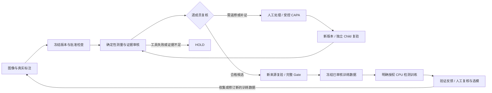

<p align="center">
  
</p>

<h1 align="center">VisionData Gate</h1>

<p align="center"><strong>让每一轮标注、质检与返修都有据可查</strong></p>
<p align="center">面向机器视觉交付团队的本地工作台：整理数据、定位问题、审核返修，把复验后的版本交给下一轮训练。</p>
<p align="center"><em>A local-first workbench for governed vision-data review, remediation and training feedback.</em></p>

<p align="center">
  <a href="https://github.com/dukeandBaron/visiondata-gate/actions/workflows/ci.yml"></a>
  <a href="LICENSE"></a>
  
  
  
  
</p>

<p align="center">
  <a href="docs/quickstart.md"><strong>本地启动</strong></a> ·
  <a href="docs/PRIVATE_AGENT_PLATFORM_WORKFLOW.md"><strong>完整工作流程</strong></a> ·
  <a href="docs/PLATFORM_DELIVERY_20260913.md"><strong>当前交付边界</strong></a> ·
  <a href="docs/architecture.md"><strong>架构</strong></a> ·
  <a href="docs/api_reference.md"><strong>API</strong></a> ·
  <a href="benchmarks/README.md"><strong>公开评估</strong></a>
</p>

## 为什么做这个工作台

机器视觉项目的交付往往跨越多轮标注、检查、返修和训练。图像、标注版本、问题说明与复验结果分散后，工程师需要反复确认：这张图为什么被隔离，谁改过框，修复后的版本有没有重新检查，下一轮训练到底用了什么。

VisionData Gate 把这段流程组织成同一项目下的可追溯工作记录。**Agent 负责理解任务、组织证据和协调工具；专业算法负责测量；人工负责审核和关键授权。** 它不替代标注员、检测模型或质量负责人的最终判断，也不是已经接通整座工厂的自动控制平台。

特别区分两种“好坏”：**产品有缺陷，不等于数据不可用。** 清晰、标注正确的缺陷图可能是重要训练样本；虚焦、跨集合重复或标注证据不足才需要返修或补证。数据池中的 `QUALIFIED_CANDIDATE` 是特定检查合同下的合格候选，不是标签真值证明或训练批准。

## 当前可以做什么

| 日常入口 | 可以完成的工作 | 保留的边界 |
|---|---|---|
| **图像工作簿** `/workspace` | 导入真实图像和支持格式的数据集，画框、命名、保存标注，查看像素剖面与质量证据 | 保存标注不等于已经复核正确 |
| **工作概览** `/command-center` | 查看项目任务与真实执行状态，检查计划、Worker 选择/排除原因、触发证据和预算 | 不播放预编造的“思考”或诊断置信度 |
| **数据池与返修版本** `/data-pools` | 逐成员审核合格候选、返修项与缺证项；保留父版本和新任务绑定 | 派生子集还需独立新 Gate，不直接进入训练 |
| **模型与 API** `/models` | 分开管理 Agent Provider 和视觉模型；显式探测连接、登记可信运行环境、冻结训练数据、查询训练与反馈 | 外部训练环境和权重不内置，不自动下载或训练 |
| **整改工单** `/capa` | 关联问题、人工批准、受控派生版本及独立 Child 复验 | 保存记录不等于执行完成，复验不自动批准生产 |

工作台采用 Graphite 中性深灰界面，保留图像画布和 IDE 式多页操作。五个日常入口常驻；案件、证据、血缘和交付工具收在可展开分组中。`Ctrl+K` 搜索页面，`Ctrl+B` 切换侧栏。首页与任务页优先显示实际项目和待办，不把能力介绍当成任务结果。

本地账户支持首次管理员初始化、注册待审批、登录/退出、密码与会话管理、账户状态和工作区成员管理。批准账户不会自动获得所有项目权限；工作区所有者分配成员资格，已启用用户也可以显式创建自己的工作区。详情见 [账户合同](docs/IDENTITY_API_CONTRACT.md)。

## 一轮数据如何进入下一轮



- 原始版本不覆盖，CAPA 保留 Parent → Human Approval → Derived Version → Child Run 血缘。
- 修复后创建新快照、新任务和新 Gate；回到同一个数据池保存新版本时，显式绑定新的来源任务，不能只修改旧记录为“已修好”。
- 数据池到检测数据集的桥接从服务端读取真实框、类别、采集分组和图像/标注摘要。它要求当前完整池版本、全员合格复核与 Gate PASS。
- 验证反馈中的误检、漏检是人工复核线索，不自动证明标签有错。下一轮显式关联已复核反馈和不同的实际数据版本，不把原验证/测试样本转成训练样本。
- `SUCCEEDED_CANDIDATE` 只说明训练、验证和权重保存完成。分数为零也必须保留；人工拒绝候选是有效结果，不用“闭环完成”掩盖效果不佳。

详细操作见 [完整工作流程](docs/PRIVATE_AGENT_PLATFORM_WORKFLOW.md)、[数据池合同](docs/DATA_POOL_API_CONTRACT.md)、[视觉模型合同](docs/VISION_MODEL_API_CONTRACT.md) 和 [数据池训练桥接](docs/VISION_DATA_POOL_ADAPTER.md)。

## 本地运行

源码工作台要求 Windows 10/11、Python 3.12、[uv](https://docs.astral.sh/uv/) 和 Node.js 22+。

```powershell
git clone https://github.com/dukeandBaron/visiondata-gate.git
cd visiondata-gate
.\setup_env.ps1
.\run_workbench.ps1 -Install
```

依赖安装需要可用的软件源；“业务数据本地保存”不等于首次安装无需网络。启动器打开本机工作台，默认页面为 `http://127.0.0.1:4173/workspace`。首次启动请使用启动器打开的页面完成管理员初始化；不要复制或公开启动能力令牌。

1. 首次创建本地管理员；后续使用自己的账户登录。
2. 创建或加入有权限的工作区，创建/选择项目。
3. 导入图像或带 COCO / YOLO / VOC / LabelMe 标注的数据集，保存并审核真实标注。
4. 冻结来源、批准检查计划，再根据证据进入返修、复验和数据池流程。
5. 需要训练时，另行配置可信外部 Python、Torch/Ultralytics 与合法权重，授权后才运行。

完成账号初始化后，私有业务 API 需要真实用户 Bearer；启动令牌不能代替登录。会话仅保存在浏览器内存，刷新或重新打开可能需要登录。健康检查 `/v1/health` 可用不代表当前用户有业务访问权。完整配置见 [Quickstart](docs/quickstart.md)。

`run_demo.ps1` 仍用于隔离的合成案件演练；它不接生产设备，也不把失败的复验改成 PASS。合成演练不是客户验收。

### Windows 安装包

当前候选的软件版本仍为 **0.1.0**，新版构建身份为 `windows-platform-rebuild-20260913-03`。截至本说明编写时，安装包正在独立构建；**本页不是安装器已生成、安装后 GUI 已通过或已签名的证明**。不同构建必须核对各自清单与 SHA-256，不沿用旧包的测试结论。

核心桌面架构为 Tauri → 本机 Spring Boot 网关 → FastAPI。外部视觉训练环境不随核心包分发。干净机、同版本升级、代码签名和完整三层 SBOM 仍需分别验收。见 [Windows 安装说明](docs/WINDOWS_INSTALLER.md)。

## 公开源码不是静态 Demo

| 形态 | 数据与权限 | 不应误解为 |
|---|---|---|
| **本地源码工作台** | 真实本机 API、账户、项目存储、标注及受控写入；需自行安装配置 | 已连接工厂、已取得生产权限 |
| **公共 Pages / 合成回放构建** | 明确标记 `PUBLIC_SYNTHETIC_REPLAY`；可在浏览器本地读取用户选择的图像，不上传到后端 | 本地登录、数据库、模型管理或训练 API 已部署到静态站 |
| **离线导出** | 保留导出当时的摘要与来源标记 | 当前在线状态或重新验证成功 |

公开仓提供可继续本地开发的前后端和桌面源码，而不是只有宣传页。静态站只服务公开演示边界；本次不宣称新的 Pages 部署已完成，已发布入口应从[当前仓库](https://github.com/dukeandBaron/visiondata-gate)核对。本机 API 的 `LIVE` 只表示连接本地服务，不表示工厂在线连接。

## 证据与未完成事项

[DynamicBench-v3](benchmarks/README.md) 是 **8 个冻结合成场景 × 2 种策略**的编排对照：动态路径正确终态 `8/8`，固定路径 `4/8`；两者 unsafe release 均为 `0/8`；工具调用 `14 vs 24`。固定路径的错误终态是保守 HOLD，不是误放行。该协议没有外部模型调用，不证明通用 Agent 优势或缺陷检测精度。

公开 [VisA 治理代理摘要](benchmarks/visa-public-proxy-summary.json) 是另一套 600 episode 协议，两策略正确终态均为 `525/600`；动态路径避免 150 次已知无效重试。原始数据与来源绑定不随仓库分发，需合法获取和绑定后复算。不要与其他图像实验合成一个准确率。

当前有界 CPU 检测训练的两轮合成工程验证产生了权重与反馈记录，**两轮 mAP 均为 0，第二轮候选被拒绝**。这证明流程可以保存失败结果并受控续轮，不证明模型精度提升。当前检测训练最多 64 个样本，不支持据此宣称大规模训练、GPU/NPU、分割训练或 TTT 已完成。

| 事项 | 当前边界 |
|---|---|
| 客户采用、节约工时、ROI、产线 NG 率改善 | 未验证，不宣称收益 |
| 工厂误放行/误拦截等独立裁决指标 | `NOT_MEASURED_PENDING_ADJUDICATION` |
| 生产发布 | `production_release_allowed=false` |
| 昇腾 / CANN 算力交接 | `PREPARED_NOT_SUBMITTED`，作业准备不是调度或设备运行 |
| Windows 新包实装 / 干净机 / 同版本升级 | 等待本次独立验收 |
| 全量质量保证或所有历史页面验收 | 不由本次局部源码/浏览器测试推出 |

边界定义见 [Claim scope](docs/CLAIM_SCOPE.md)、[平台交付说明](docs/PLATFORM_DELIVERY_20260913.md) 和 [发布边界](docs/PUBLICATION_BOUNDARY.md)。历史 [工作台截图](docs/assets/web-command-center.png) 仅用于旧布局参考，不作为最新 Graphite 界面的验收截图。

## 接入现有工作流

- `skills/`、`rulepacks/`、`schemas/`：窄权限工具合同、版本化规则和可核对的数据结构。
- CVAT / FiftyOne：本地整改导出和回传合同，不等于外部服务已经连接。
- Provider Profiles：按工作区管理的可选 Agent 模型服务；密钥仅在服务端，不在浏览器包中。
- [数据复核与算力交接](docs/DATASET_REVIEW_AND_COMPUTE.md)：准备版本绑定的作业元数据。无调度回执时，不宣称上传、NPU 分配或训练已运行。

MES、OPC UA、PLC、相机和 Hosted Transport 未取得真实端点、身份及探测回执时保持未连接。平台管理模型与数据流程，不授予生产设备写权限。

## 安全、许可与开发

原始图像默认留在本地；本机 HTTP 导入与向第三方传输是不同动作。`raw_images_transmitted=false` 是当前核心合同边界，不是全机网络审计报告。`machine_write_permitted=false`，`production_decision_authority=human_only`。

已验证结果刷新失败时显示 stale/HOLD，不继续呈现 PASS。CAPA、数据池或训练写入结果未知时，使用原操作标识显式 GET 对账，不自动重放写请求。SHA-256/JCS 提供内容身份与篡改检测，不是数字签名或可信时间戳。

本项目代码采用 Apache-2.0；外部 Ultralytics、模型权重和数据集遵守各自条款。Ultralytics 的 AGPL-3.0 / Enterprise 适用性必须另行核对，分进程不自动免除许可义务。`.pt` 需要可信来源和显式加载风险确认，登记摘要并不证明文件安全。

```text
src/visiondata_gate/   Agent、账号、数据池、视觉模型、API 与审计
web/                  React 桌面工作台与独立静态回放模式
desktop/              Tauri 桌面壳与打包配置
gateway/              本机 Spring Boot 网关
skills/ rulepacks/     工具合同与版本化规则
schemas/              请求、证据和回执合同
benchmarks/           可公开的合成评估与受限含义摘要
sample_data/          隐私安全的合成示例
tests/ docs/          实现验证、使用与边界说明
```

从 [CONTRIBUTING.md](CONTRIBUTING.md) 开始贡献；安全问题请按 [SECURITY.md](SECURITY.md) 私下报告。另见 [Compliance](docs/compliance.md)、[Audit Envelope](docs/audit_envelope.md) 和 [LICENSE](LICENSE)。
