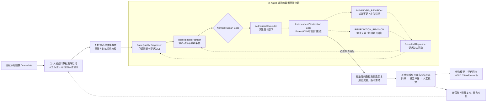

# 2026-09-15 技术评审指导闭环

## 结论

评审意见成立，但应当做一次关键纠偏：它主要要求我们把业务主线和技术页讲
清楚，并不意味着需要推倒现有六阶段 Agent Runtime，或凭一张草图新增四个
自治 Agent。最合理的落地是：

1. 用三个业务阶段解释从原始图像到模型反馈的完整生命周期；
2. 用五个受控功能解释数据治理控制环，其中把口语化的 Solver 拆成“规划”与
   “人工授权执行”；
3. 把模型预测、数据质量裁决、标签真值和生产放行四种权力严格分开；
4. 对尚未实现的 VLM 预标注、Top-K 样本挖掘、Active Learning、TTT 和自动
   Mask 生成保持明确的 `NOT_IMPLEMENTED / NOT_CONNECTED`。

规范词汇见 [技术术语与架构口径](TECHNICAL_TERMINOLOGY.md)。

## 来源与核验边界

本次分析使用以下用户提供材料：

- `20260915_113153.m4a`，约 25 分 17 秒；
- `20260915_115714.m4a`，约 28 分 34 秒；
- 两份用户提供的 TurboScribe 转写；
- 一张手写技术路线草图；
- 本地 Faster-Whisper `large-v3-turbo` 第二转写，用于时间锚和词义交叉核对。

原始转写存在明显同音错误和重复，例如 VLM、YOLO、Detector、Solver、
Evaluator、Position、Scale、Parent Run、Child Run 等词被多次误识别。本文不
把无法确认的词逐字引用为事实，而是只保留两份转写、上下文和现有代码共同
支持的技术含义。原音频与逐字稿保留在本机分析目录，不进入 Git、公开快照或
发行包。

## 评审意见的论证链

### 1. 先回答数据集如何形成

在第一段约 `09:16–09:44`，评审明确建议把“人工标注”改成“人机协同”：模型
先产生不确定样本或候选标注，人工再判断框、类别和问题是否成立。约
`17:19–18:07` 又强调第一阶段输出的数据天然可能存在标注不准、重复、覆盖不
足等问题，因此只能叫候选数据集，后续治理才有存在价值。

工程解释：第一阶段不是“VLM 自动生成真值”，而是
`HUMAN_AI_COLLABORATIVE_DATASET_BOOTSTRAP`。当前项目已有人工标注、版本冻结
和用途复核；VLM 预标注尚未连接，不能在 PPT 中写成已完成能力。

### 2. 再回答 Agent 到底治理什么

第一段约 `12:37–13:55` 建议把第二阶段命名为 Agent 驱动的数据治理，并区分
上层信息补充与下层 Worker 执行。约 `13:57–16:23` 追问 Top-K、聚类、问题
占比和补采依据，核心并不是要求强行使用某个算法，而是要求讲清“为什么选这
批数据、选完后补什么证据、预算如何分配”。

工程解释：当前 `worker_selection.py` 做的是 **Worker 调度优先级**，不是
Top-K 困难样本挖掘；`governed_context.py` 中的 Top-K 是受控记忆检索，也不是
样本聚类。若没有新的样本级 query strategy，就不得把现有排序包装成 Active
Learning 或 Top-K hard-example mining。

### 3. 最后回答模型怎样训练、评估并反馈

第二段约 `13:13–16:20` 将整体结构归纳为人机协同标注、数据治理和模型训练
三个阶段。约 `17:43–22:08` 进一步讨论边界框、Mask、Position、Scale 和
Multi-task，实质问题是：模型到底输出什么监督信号、训练几个任务、哪些标签
真实存在、哪些只是设想。

工程解释：当前项目有两个不同模型路径，不能混写：

- 有界 YOLO detect 路径读取标准边界框，执行监督检测训练并输出验证分歧；
- YOLO26n classification 多尺度特征重建是 Normality 开发代理，异常 Mask 只
  用于公共开发评估，不参与权重更新。

当前没有 VLM 预标注回执，没有自动 Mask 真值生成，也没有经过验证的
Position+Scale 双模型或 Multi-task detection head。

### 4. 评估失败必须分两条路反馈

第二段约 `07:30–08:47`、`09:30–10:55` 和 `11:34–13:04` 将草图收敛为诊断、
解决、评价、重规划，并明确评价失败至少有两种原因：前面问题找错了，或者
问题找对但解决方法无效。

工程解释：

- 问题找错、证据不足或证据过期，走 `DIAGNOSIS_REVISION`，回到诊断和主动
  补证；
- 整改后持续存在、出现新回归或验收条件不满足，走
  `REMEDIATION_REVISION`，回到整改规划或转人工调查。

现有内核已经分别持有 Evidence Gap/Fresh Replan 和 Child Run
`PERSISTENT_FINDINGS_REMAIN / REGRESSION_DETECTED` 证据。本轮只统一解释层，
不再复制一套平行状态机。

## 评审草图的标准化重画

### Figure brief

```yaml
figure_goal: 用一页解释数据从冷启动、治理到模型反馈的完整闭环
paper_claim: VisionData Gate 通过确定性诊断、人工授权整改和独立复验形成用途受限的数据候选，并把模型分歧安全送回下一轮
figure_type: system-architecture
mode: image
panels:
  - 人机协同数据集冷启动
  - Agent 编排的数据质量治理控制环
  - 受控模型开发与反馈回流
must_keep_labels:
  - Initial Candidate Dataset Version
  - Data Quality Diagnoser
  - Remediation Planner
  - Named Human Gate
  - Independent Verification Gate
  - Bounded Replanner
  - Governed Dataset Candidate Version
data: not_applicable
style_constraints:
  - 白底、横向 16:9、学术矢量风格
  - 中文短标签，保留标准英文协议名
  - 实线表示主流程，虚线表示反馈，红色只表示 HOLD/回归
output_formats: [svg, png]
verification_checklist:
  - 不出现 Accurate Dataset 或自动生产放行
  - 人工闸门位于整改执行之前
  - 诊断修订和整改修订是两条不同反馈
  - VLM、Mask、Active Learning 未实现状态可见
```

### 推荐图



## 当前代码事实对照

| 评审概念 | 当前真实实现 | 证据模块 | 裁决 |
|---|---|---|---|
| 人工标注与复核 | 图像工作区、BBox、annotation revision、人工 acceptance contract | `operator_workspace.py`、`operator_snapshot.py` | `IMPLEMENTED_LOCAL` |
| VLM 辅助预标注 | 没有成功连接回执；原始图不发送到 OpenToken | `RUNNING.md`、Provider boundary | `PLANNED_NOT_CONNECTED` |
| 初始候选数据集 | 任务快照、数据池成员、版本和人工去向 | `data_pool.py`、`learning_dataset.py` | `IMPLEMENTED_LOCAL` |
| 数据质量诊断 | 清晰度、曝光、重复、标注、覆盖、metadata 和来源资格 | `quality.py`、`duplicates.py`、`annotations.py`、Incident v6 | `IMPLEMENTED_LOCAL` |
| 动态 Worker | selected/rejected、原因、预算、触发证据与 execution DAG | `worker_selection.py`、`incident_agent_kernel.py` | `IMPLEMENTED_LOCAL` |
| 整改规划与人工闸门 | Action Contract、候选方案、具名选择和 CAPA 绑定 | `incident_decision_packet.py`、`capa.py` | `IMPLEMENTED_LOCAL` |
| 整改执行 | 只允许批准后的派生副本；没有设备写入 | `capa.py` | `BOUNDED_DERIVED_COPY_ONLY` |
| 独立评价 | Parent/Child Finding 集合差分、持续项和回归项 | `ChildRunClosureVerification` | `IMPLEMENTED_LOCAL` |
| 监督检测 | 外部受控运行环境、标准 YOLO BBox、CPU 小预算训练、固定验证分歧协议 | `learning_yolo_backend.py` | `BOUNDED_LOCAL_RUNTIME` |
| Normality 模型 | VisA 正常样本特征重建、开发集指标、模型包验证与本地推理边界 | `model_experiment_agent.py`、`normality_inference.py` | `PUBLIC_DEVELOPMENT_ONLY` |
| 模型反馈回流 | FP/FN 候选 → 人工分类 → 新任务/新数据；val/test 不自动进入 train | `learning_service.py`、`learning_projection.py` | `IMPLEMENTED_LOCAL` |
| Top-K 困难样本挖掘 | 当前只有 Worker 排序和记忆检索 Top-K，未形成样本 query engine | 无样本级策略回执 | `NOT_IMPLEMENTED` |
| Active Learning | 没有未标注池 query strategy、人工 oracle 分母和独立对照 | 无 | `NOT_IMPLEMENTED` |
| TTT | 只有 retention/forgetting 评估合同；运行时不更新模型 | `continual_learning.py` | `RUNTIME_NOT_IMPLEMENTED` |
| 自动 Mask 生成 / 分割训练 | Heatmap 和参考 Mask 不等于生成真值；监督 Mask 更新被拒绝 | Normality plan / registry | `NOT_IMPLEMENTED` |

## 机器可读状态口径

下列状态必须在后续 PPT、README 和答辩稿中保持一致：

```text
VLM_ASSISTED_PRE_ANNOTATION=PLANNED_NOT_CONNECTED
SUPERVISED_BBOX_DETECTOR=BOUNDED_LOCAL_RUNTIME
NORMALITY_PROXY=PUBLIC_DEVELOPMENT_ONLY
MASK_GENERATION=NOT_IMPLEMENTED
TOP_K_SAMPLE_MINING=NOT_IMPLEMENTED
ACTIVE_LEARNING_QUERY_ENGINE=NOT_IMPLEMENTED
TTT_RUNTIME=NOT_IMPLEMENTED
LABEL_TRUTH_AUTHORITY=HUMAN_OR_EXTERNAL_QMS_ONLY
production_release_allowed=false
machine_write_permitted=false
```

这里的 `MASK_GENERATION=NOT_IMPLEMENTED` 专指模型自动生成缺陷分割 Mask；它不
否定现有“具名人员确认无前景后生成全零 Mask 副本”的受控数据准备能力，也不
把 Normality heatmap 当作标注。

## 术语纠偏表

| 原口语/草图词 | 规范替换 | 说明 |
|---|---|---|
| 人工标注 | 人机协同数据集冷启动 | 当前人工为主，模型/VLM 只能做候选建议 |
| Coarse Dataset | 初始候选数据集版本 | 不用“粗糙”评价数据，只陈述资格未建立 |
| Detector | Data Quality Diagnoser | 与视觉模型的 object detector 区分 |
| Solver | Remediation Planner + Authorized Executor | 拆开 Agent 建议权和人工执行权 |
| Evaluator | Independent Verification Gate | 强调同合同、独立 Child Run 和 fail-closed |
| Planner | Evidence-gap-driven Bounded Replanner | 不是任意改变流程的通用 LLM |
| Accurate Dataset | 经治理的数据集候选版本 | 没有独立真值时不使用“准确” |
| 有效困难样本 | 困难样本候选（人工裁定） | 与质量不合格、标签问题、分布变化分开 |
| 数据饥饿 | 数据覆盖不足 / 代表性不足 | 用可度量的 coverage 和 collection group 表述 |
| Test and Train | 受控 Train–Evaluate–Review 迭代 | 不冒充 Test-Time Training |
| Position + Scale | ROI 定位 + 多尺度细粒度检测（规划项） | 当前未形成双模型或多任务验证回执 |
| 伪造 Mask | 模型生成的伪标签 Mask 候选 | 必须与人工/QMS 参考 Mask 分开 |

## 本轮落地与后续优先级

### P0：本轮完成

- 新增规范术语表和评审闭环文档；
- README、3 分钟陈述稿、Q&A 和工业路线统一为三阶段主线；
- Web 人工反馈文案将 `HARD_SAMPLE` 显示为“困难样本候选（人工裁定）”；
- 后端 docstring 明确人审分类、BBox 检测和 Normality 代理的不同范围；
- 新增回归测试，阻止“精准数据集、VLM 已接入、自动 Mask、TTT 已实现”等
  说法重新进入主叙事。

### P1：下一轮可实现，但必须另立实验

1. 把已批准模型的预测框以**只读建议层**送入标注画布，人工确认后才创建新
   annotation revision；
2. 定义样本 query strategy：不确定性、预测/标注分歧、覆盖缺口和多样性必须
   分项计分，并设置固定预算；
3. 在相同标注时间预算下比较“随机抽样、置信度抽样、分歧+覆盖抽样”，报告
   人工复核成本和独立验证集效果；
4. 将 `DIAGNOSIS_REVISION` 与 `REMEDIATION_REVISION` 投影到前端，但仍从真实
   Evidence/Child 回执读取，不由 UI 推断。

### P2：有外部证据后再做

- 真实 VLM 预标注服务和许可评估；
- Position+Scale 两阶段检测或 Multi-task Detection 对照；
- 自动 Mask 伪标签及独立人工像素级评估；
- 真实工厂 shadow、双人/QMS 真值和生产 KPI；
- 在线 Continual Learning 或 TTT 的污染隔离、回滚与现场验证。

## 40 秒标准回答

> VisionData Gate 的业务链分三步。第一步是人机协同数据集冷启动，人工标注
> 为主，可选模型只提供预标注候选，输出是质量尚未确立的初始候选版本。第二
> 步是 Agent 编排的数据质量治理：确定性工具诊断问题，Agent 形成整改计划，
> 具名人员批准后只在派生副本执行，再由 Child Run 按同一合同独立复验。复验
> 发现诊断不成立就回到补证，发现整改无效或引入回归就回到整改规划。第三步
> 才是受控模型开发与反馈回流，模型分歧必须经人工裁定，并通过新数据进入下
> 一轮。当前完成的是本地 BBox 检测合同和 Normality 开发代理；VLM 预标注、
> Active Learning、TTT 和自动 Mask 生成仍未实现，所以最终交付称为经治理的
> 数据集候选版本；在缺少独立真值时，不作数据准确性已经独立证明的结论。
