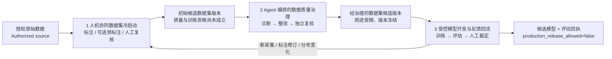
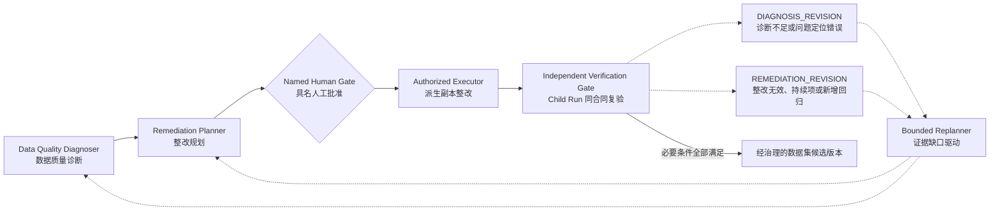

# VisionData Gate 技术术语与架构口径

本文件是 README、PPT、Demo、答辩稿和产品界面的规范词汇表。它统一业务
表达，但不改写已经发布的 API 枚举、历史回执或冻结实验名称。任何口径若与
运行工件冲突，以强类型合同、持久化回执和实际测试结果为准。

## 一句话主线

VisionData Gate 不是“自动找坏图并自动修图”的模型，而是一套面向工业视觉
数据版本的受控闭环：先形成可复核的初始候选数据集，再由 Agent 编排确定性
诊断、人工授权整改和独立复验，最后把通过用途约束的数据版本交给受控模型
开发，并将验证分歧送回人工复核和下一轮数据采集。

## 三个业务阶段

| 规范标识 | 中文名称 | 输入 | 主要动作 | 输出 | 不代表 |
|---|---|---|---|---|---|
| `HUMAN_AI_COLLABORATIVE_DATASET_BOOTSTRAP` | **人机协同数据集冷启动** | 经授权的原始图像、相机元数据和已有标注 | 人工标注；可选模型/VLM 只做预标注；人工复核版本与用途 | **初始候选数据集版本** | 标签真值已独立确认、数据已准入训练 |
| `AGENT_ORCHESTRATED_DATA_QUALITY_GOVERNANCE` | **Agent 编排的数据质量治理** | 初始候选数据集版本和质量合同 | 只读诊断、证据补全、整改计划、具名人工批准、派生副本整改、Child Run 复验 | **经治理的数据集候选版本**（仅在必要条件满足时；否则 `HOLD`） | “准确数据集”、生产数据已放行、根因已成立 |
| `GOVERNED_MODEL_DEVELOPMENT_AND_FEEDBACK` | **受控模型开发与反馈回流** | 通过当前用途门禁的冻结训练候选、独立 val/test | 有界训练、模型评估、分歧样本生成、人工裁定、下一轮数据采集或标注修订 | 候选模型、评估回执、反馈队列和下一轮输入 | 在线持续学习、Test-Time Training、生产模型批准 |

### 总体图



“候选”是必要限定词。没有独立真值、用途合同和门禁回执时，不使用
`Accurate Dataset`、`精准数据集`或“高质量数据已确认”等结果性表述。

## 数据治理控制环的五个功能

评审草图中的 Detector、Solver、Evaluator、Planner 是解释层功能，不应直接
宣传成四个新增自治 Agent。为避免“Solver 既提方案又越权执行”的歧义，规范
口径把 Solver 拆成计划与执行两种权限，因此运行解释采用五个功能：

| 规范标识 | 推荐中文 | 评审草图对应 | 当前工程映射 | 权限边界 |
|---|---|---|---|---|
| `DATA_QUALITY_DIAGNOSER` | 数据质量诊断器 | Detector | 图像/标注/重复/覆盖/元数据工具、Evidence Ledger、专项 Worker | 只产生测量、Finding、竞争假设和证据缺口 |
| `REMEDIATION_PLANNER` | 整改规划器 | Solver 的“提出方案”部分 | Decision Packet、Action Contract、候选 CAPA 方案 | 只能建议和排序；不能批准或执行 |
| `AUTHORIZED_REMEDIATION_EXECUTOR` | 授权整改执行器 | Solver 的“执行”部分 | 具名人工批准后的 CAPA 派生副本流程 | 不覆盖原始来源；不控制 PLC、相机或产线 |
| `INDEPENDENT_VERIFICATION_GATE` | 独立复验门禁 | Evaluator | Parent/Child 同合同差分、持续项/关闭项/回归项核验 | 不能把零回归自动写成生产放行 |
| `EVIDENCE_GAP_DRIVEN_BOUNDED_REPLANNER` | 证据缺口驱动的有界重规划器 | Planner | Worker Selection、预算、fresh replan、可选外部 Planner 优先级 | 只能在白名单 Worker 和冻结预算内改变下一步 |

PPT 若必须保持四个盒子，可把 `REMEDIATION_PLANNER` 与
`AUTHORIZED_REMEDIATION_EXECUTOR` 视觉上合并为“Remediation”，但必须用
人工闸门将“建议”与“执行”分开。

### 控制环与两条反馈



两条反馈不得合并为一句“效果不好就重规划”：

- `DIAGNOSIS_REVISION`：原问题定位缺证、相互矛盾、证据过期，或复验事实说明
  初始诊断不能成立。目标是重新诊断和主动补证。
- `REMEDIATION_REVISION`：问题定位仍成立，但整改后存在持续 Finding、新增
  回归或验收条件未满足。目标是重选整改方案或转人工调查。

## 数据工件的规范名称

| 不推荐说法 | 规范说法 | 原因 |
|---|---|---|
| 原始数据就是好/坏数据 | 经授权的原始数据版本 | 产品缺陷与数据可用性是两个问题 |
| 粗糙数据集 / Coarse Dataset | 初始候选数据集版本 | 明确它尚未获得质量或训练资格 |
| Accurate Dataset / 精准数据集 | 经治理的数据集候选版本 | 治理不能在没有独立真值时证明“准确” |
| 清洗后的最终数据 | 用途受限、版本冻结的数据候选 | 后续合同、来源或用途变化会使证据过期 |
| 坏数据 | `REPAIR_REQUIRED` 或 `UNVERIFIED_HOLD` 样本 | 一个缺陷产品图像仍可能是有价值训练数据 |
| 好数据 | `QUALIFIED_CANDIDATE` | 仍不自动获得训练摄入权或生产放行权 |
| 模型标签 | 模型预测 / 预标注候选 | 模型输出不是人工或 QMS 真值 |
| Mask 真值 | 参考 Mask / 经裁定 Mask | 公共数据标注和模型热力图都不天然等于现场真值 |

推荐的数据版本链为：

```text
AUTHORIZED_RAW_SOURCE
→ INITIAL_CANDIDATE_DATASET_VERSION
→ REVIEWED_ANNOTATION_VERSION
→ GOVERNED_DATASET_CANDIDATE_VERSION
→ FROZEN_TRAINING_CANDIDATE_SNAPSHOT
→ CANDIDATE_MODEL_ARTIFACT
→ SANDBOX_APPROVED_MODEL_CANDIDATE
```

上述链条没有 `PRODUCTION_MODEL` 或 `PRODUCTION_RELEASED_DATASET`。生产权限由
外部组织、真实 IAM、具名审批和现场验收决定。

## 样本分类的规范边界

“困难样本”不能同时指图像质量差、标签错误、模型低置信度、分布变化和真实
罕见缺陷。必须先区分证据类型：

| 类别 | 含义 | 可以触发 | 不可自动推断 |
|---|---|---|---|
| `QUALITY_NONCONFORMING_SAMPLE` | 清晰度、曝光、解码、几何或元数据不满足当前质量合同 | 重采、返修、调查 | 产品一定有缺陷 |
| `LABEL_REVIEW_CANDIDATE` | 预测与参考标注不一致，标签需要人工复核 | 人工裁定或修订标注 | 标签已经错了 |
| `MODEL_ERROR_CANDIDATE` | 在固定评估协议下产生 FP/FN 或定位偏差 | 模型诊断、再训练候选 | 模型总体不合格 |
| `HARD_EXAMPLE_CANDIDATE` | 人工确认对当前任务确有学习价值的困难案例 | 采集相似训练样本 | 自动进入 train，或从 val/test 搬入 train |
| `DISTRIBUTION_SHIFT_CANDIDATE` | 新批次与冻结训练分布可能发生变化 | 代表性补采和独立验证 | 已经证明分布漂移 |
| `INSUFFICIENT_EVIDENCE` | 当前证据不能支持以上分类 | HOLD、补证 | 零错误或正常样本 |

API 为兼容既有回执保留 `LABEL_ERROR`、`HARD_SAMPLE`、
`DISTRIBUTION_SHIFT` 和 `INSUFFICIENT_EVIDENCE` 等 wire value。对外解释必须
补充“具名人工裁定”或“候选”限定，不根据模型置信度直接写成真值。

## 模型路线的规范名称

项目中三条路线必须分开陈述：

1. **VLM-assisted pre-annotation（VLM 辅助预标注）**：路线设想，当前未连接；
   如果未来接入，输出仍只是候选框、候选类别和解释文本，必须人工复核。
2. **Supervised bounding-box detector（有界监督边界框检测器）**：现有
   `learning_yolo_backend.py` 可在显式授权的外部运行环境中执行小预算 YOLO
   detect 训练，并在固定 confidence/IoU 协议下产生验证分歧。
3. **Normality development proxy（正常性开发代理）**：现有 YOLO26n
   classification 多尺度特征重建实验只使用正常训练样本；异常 Mask 只用于
   checkpoint 选择之后的公共开发评估。它不是监督边界框检测器，也不是生产
   分割模型。

### VLM 与教师/学生路线不能混称

| 规范术语 | 含义 | 当前项目状态 |
|---|---|---|
| **VLM-assisted pre-annotation** | VLM 生成候选框、候选类别或文本说明，人工确认后才形成 annotation revision | `PLANNED_NOT_CONNECTED` |
| **Pseudo-labeling** | 模型输出按明确置信度/校准协议作为训练伪标签，并保留来源与误差评估 | `NOT_IMPLEMENTED` |
| **Knowledge distillation** | 学生模型学习教师 logits、soft target 或中间特征，而不是简单读取人工确认后的标签 | `NOT_IMPLEMENTED` |
| **Weak supervision** | 使用规则、启发式或多个噪声标注源生成可建模的不完全监督信号 | `NOT_IMPLEMENTED` |

因此“大模型标注小模型”“大小模型嵌套”不是可用的技术名称。当前状态统一为：

```text
CURRENT_VLM_LEARNING_PARADIGM=NONE
```

未来若 VLM 候选经过人工确认后再训练 BBox detector，这仍属于 model-assisted
annotation + supervised learning；只有直接使用未确认模型标签、教师概率或弱
标注函数时，才分别使用 Pseudo-labeling、Knowledge distillation 或 Weak
supervision。

下列术语只有满足对应工程条件后才能使用：

| 术语 | 最低工程条件 | 当前口径 |
|---|---|---|
| Active Learning | 明确 query strategy、未标注池、预算、人工 oracle、独立评估 | 当前没有 query engine，不使用该完成时表述 |
| Continual Learning | 时间/任务序列、保留/回放策略、遗忘指标和独立门禁 | 已有 retention evaluation 合同；不等于在线部署 |
| Test-Time Training / TTT | 推理时真实参数更新、回滚、污染隔离与运行证据 | 当前运行时未实现 |
| Multi-task Detection | 共享 backbone 与两个以上经训练/评估的任务 head | 当前未以该架构形成验证回执 |
| Position + Scale | 明确 ROI 定位与多尺度细粒度检测协议 | 当前只可作为后续模型设计，不冒充既有结果 |
| Segmentation / Mask Generation | 像素级输出、标注协议、独立指标和回执 | 当前不宣称自动 Mask 真值生成 |

## Agent、工具、模型与人的角色

- **Tool**：产生可复算测量，例如 Laplacian 清晰度、dHash、缩略图 MAE、
  BBox 几何和元数据一致性。
- **Worker**：在白名单任务内调用工具并生成回执；Worker 不等于一个大模型。
- **Agent Runtime**：理解合同、维护证据状态、选择 Worker、组织竞争假设和交付
  下一步；不直接制造测量事实。
- **Deterministic Evidence Council**：对 typed finding、支持证据、反证和未决项
  做确定性交叉检查。历史回执中的 `AI Expert Council` 是 legacy display label，
  不表示多位真人专家或多个外部大模型。
- **Optional External Planner**：最多提供建议或调整已选 Worker 优先级；不能
  新增 Finding、批准 CAPA、修改设备或生产放行。
- **Perception Model**：输出检测、分数、热力图或预测框；模型预测不等于数据
  治理裁决。
- **Named Human Owner**：裁定标签争议、选择 CAPA、授权派生整改，并承担最终
  业务责任。

## 答辩中的标准短句

> 我们把项目分成三个阶段：人机协同数据集冷启动、Agent 编排的数据质量治理、
> 以及受控模型开发与反馈回流。治理阶段不是四个新 Agent，而是五个受控功能：
> 数据质量诊断、整改规划、人工授权执行、Child Run 独立复验和证据缺口驱动
> 重规划。复验若说明问题定位不对，就回到诊断；若说明整改方法无效或引入
> 回归，就回到整改规划。最终得到的是用途受限、可追溯的数据集候选版本；
> 在缺少独立真值时，不作数据准确性已经独立证明的结论。
