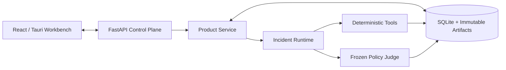
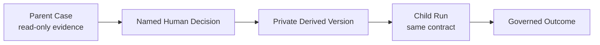

# Architecture

VisionData Gate is a governed evidence agent between industrial vision data preparation and model release. It turns images, annotations, metadata, policy, human decisions, and remediation results into a versioned Case rather than a transient chat response.

## System map



The Web and API surfaces share the same product service and persisted facts. The static GitHub Pages build is a separate read-only projection and has no backend authority.

## Controlled lifecycle

```text
Intake -> Planner -> Tool -> Council -> Judge -> Delivery
             ^         |
             |---------|  evidence-gap-driven re-planning
```

1. **Intake** validates source authorization, task scope, rulepack, allowed tools, and runtime profile.
2. **Planner** creates a bounded plan and budget. External models are optional advisors, not judges.
3. **Tool** executes allowlisted deterministic measurements and persists Tool Receipts.
4. **Council** reconciles cited evidence and competing hypotheses without changing measurements.
5. **Judge** applies a frozen policy. Missing required evidence, drift, or tool failure fails closed.
6. **Delivery** produces the Decision Packet, responsibility queue, trace, and audit envelopes.

## Deterministic measurement layer

The core tool families are deliberately independent from the planner:

| Tool family | Typical evidence |
|---|---|
| Image quality | decode status, dimensions, intensity statistics, Laplacian sharpness |
| Duplicate leakage | byte identity, dHash distance, MAE, split membership |
| Annotation integrity | missing annotations, BBox/Mask geometry, image-label dimensions |
| Coverage matrix | condition, station, view, and scenario coverage |
| Governance audit | metadata drift, source scope, authorization, and policy bindings |

A Worker can request a tool; it cannot silently rewrite the tool result or release decision.

## Bounded re-planning

Re-planning is enabled only when new evidence changes the next required action. Each choice records:

- selected and rejected Workers;
- reason codes and triggering evidence;
- allowed tool and call budget;
- evidence freshness and source authorization epoch;
- resulting Tool Receipt and terminal disposition.

Planner modes are `off`, `shadow`, `gated`, and `replay`. If a request would exceed its context budget, the runtime takes a deterministic zero-call path. A provider failure cannot widen tool or production permissions.

## Parent, Human, Derived, Child

Remediation never mutates the parent source in place:



CAPA requires a named human approval bound to the selected proposal and budget. The derived version is staged and verified before publication inside the local product root. The Child Run uses the same rule and evidence contract. Open responsibility items or regression keep the outcome on HOLD.

## Concurrency and recoverability

- Mutable resources use explicit revision fields; read projections expose strong ETags and content digests.
- Writes require the current `expected_revision` or contract-specific prior digest; stale updates return a conflict instead of overwriting newer state.
- Idempotency keys bind repeated task, CAPA, and re-verification requests.
- Persisted review projections bind source facts, projection SHA-256, ETag, and LIVE/REPLAY origin.
- Missing or corrupt artifacts return an explicit recoverable state; the UI does not invent a fallback `PASS`.

## Audit model

Case and outcome envelopes use RFC 8785 JCS, fixed domains, and length-prefixed SHA-256 framing. They bind phase events, Worker receipts, runtime profile, policy, Parent/Human/Child lineage, and production boundaries. See [Audit envelope](audit_envelope.md).

## Authority boundary

These values are invariants, not UI labels:

```text
machine_write_permitted=false
production_decision_authority=human_only
production_release_allowed=false
```

VisionData Gate currently performs data governance and release-readiness work. It is not a defect-detection model, PLC controller, production IAM system, or substitute for a qualified quality owner.
